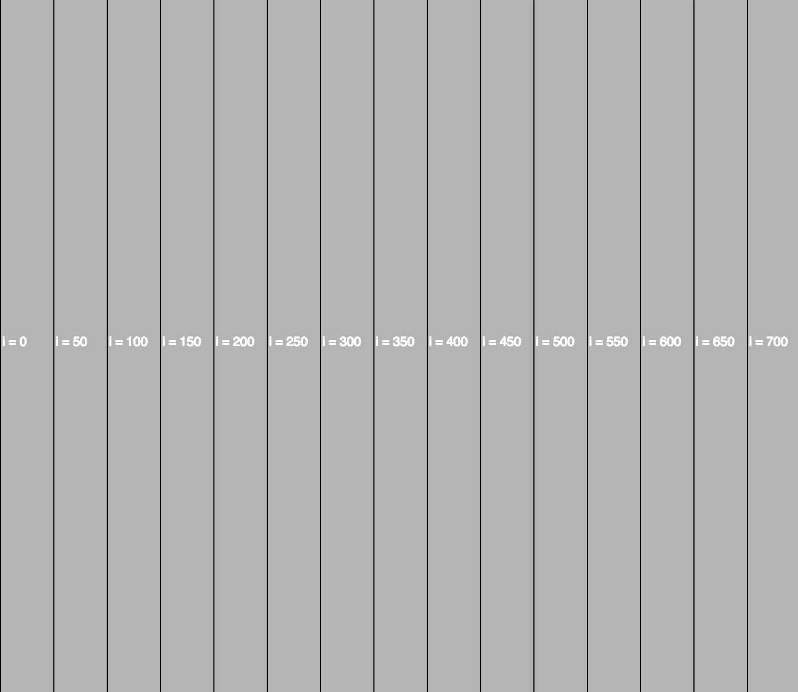
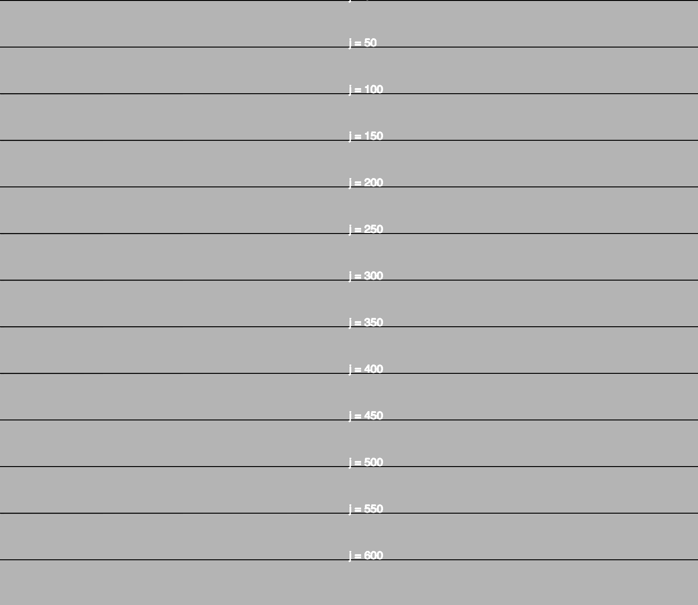
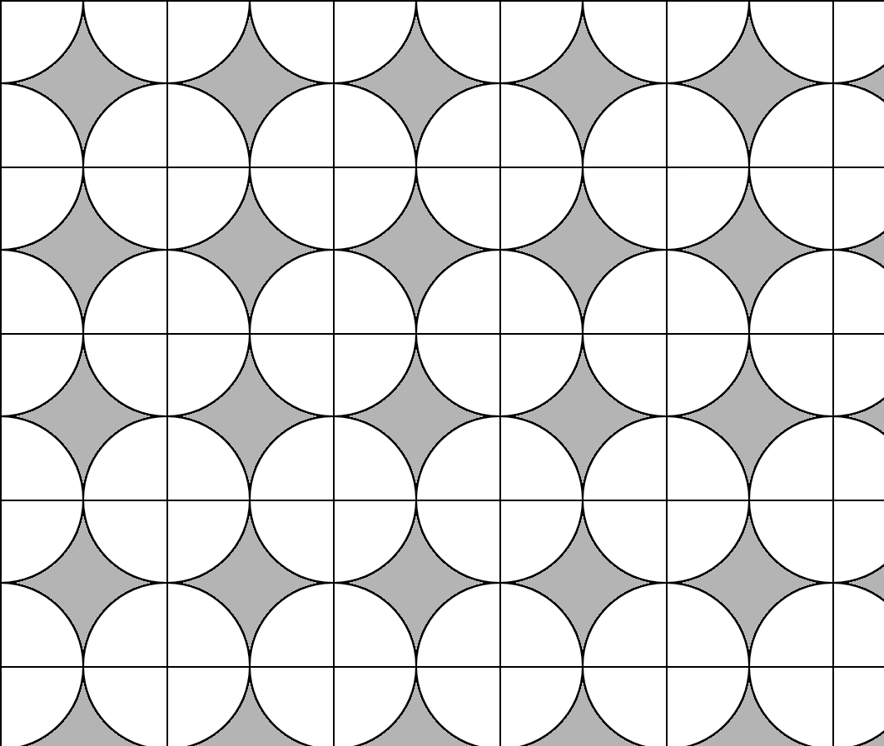
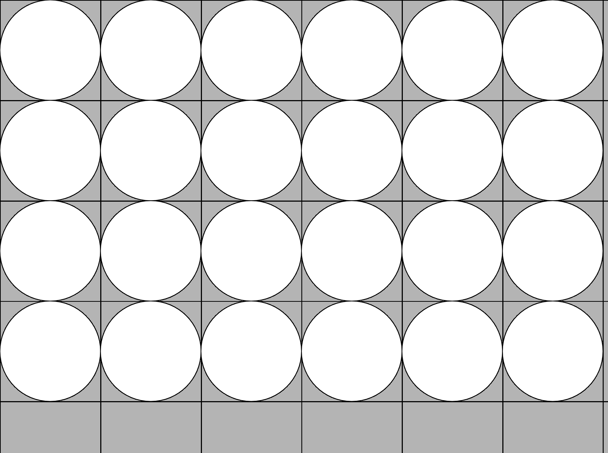
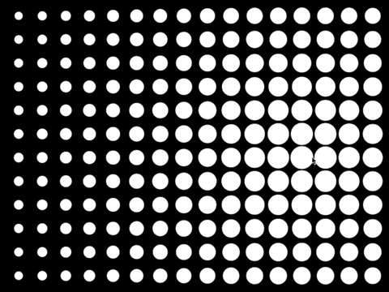
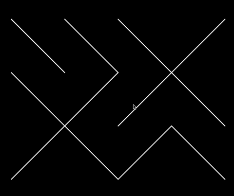
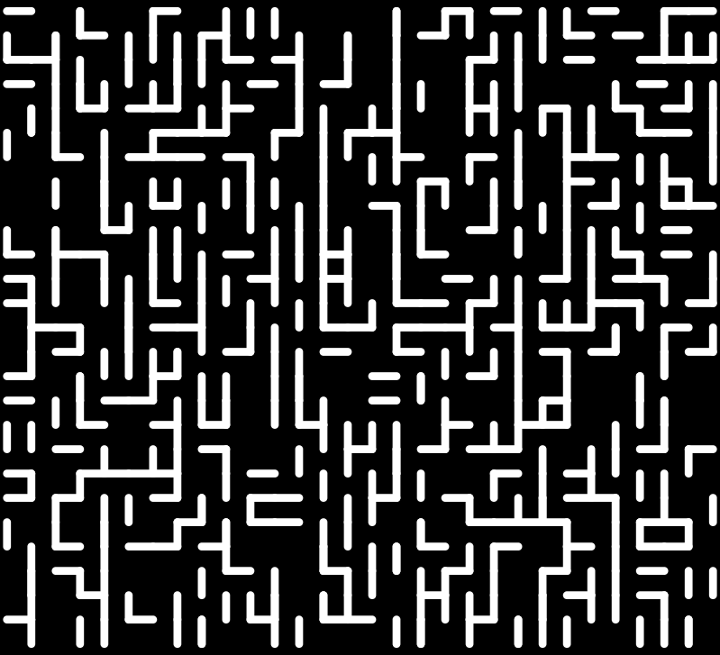
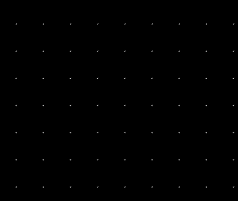
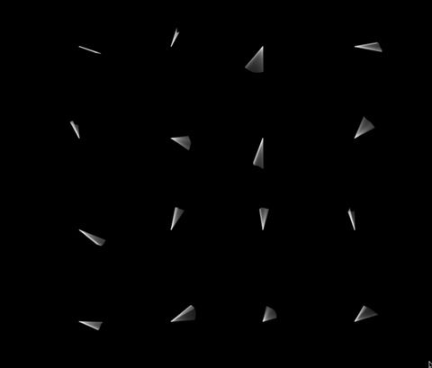

# p5js-designing-interactive-patterns

P5js est un projet issu de processing qui est un langage de programmation basé sur java orienté vers la création graphique et interactive. P5js a pour but de transposer l'esprit de processing au web et donc au langage javascript. C'est un framework simple d'accès pour les débutants avec une bonne documentation et une communauté active. 

P5js propose l'intégration dans un canvas html5 d'un maximum de fonction pour le dessin et d'animation, des possibilités d'interaction à travers différentes interfaces homme machine (clavier, souris, webcam, micro ...), ou encore avec les composants d'une page web et un support partiel mais en développement de webgl.

Vous pouvez consulter [la référence de p5js](https://p5js.org/reference/) qui va décrire avec des exemples l'ensemble des fonction de p5js, mais n'hésitez pas à aussi consulter [les exemples](https://p5js.org/examples/) - qui peuvent par contre s'avérer être un peu plus compliqués à comprendre.

De nombreuses bibliothèques viennent offrir de nouvelles possibilité, mais  p5js peut naturellement s'interfacer avec n'importe quelle bibliothèques js.

Nous allons ici travailler avec [openprocessing.org](https://www.openprocessing.org/), il vous faudra donc créer un compte en ligne et vous pourrez ainsi écrire du code qui sera automatiquement hébergé en ligne et accessible à n'importe qui si vous le souhaitez.

Ce n'est pas la seule façon de procéder, si vous souhaitez plus de détails sur les différentes façon de travailler avec p5js vous pouvez vous référer à [cette portion de cours](https://github.com/b2renger/Introduction_p5js#p5js_tools) 

J'en profite d'ailleurs pour vous donner d'autres liens vers des supports de cours p5js :
- https://github.com/b2renger/Introduction_p5js
- https://github.com/b2renger/p5js_codecreatif

Le premier lien dispose d'ailleurs de rubriques *ressources* et *références* en fin de page qui pointent vers d'autres tutoriels ou bibliothèques et vers des projets artistiques et / ou ludiques impliquant des technos web.

## Les grandes différences entre processing et p5js

### Les différences théoriques

Je vous conseille de commencer par lire les [principes de bases](https://github.com/b2renger/Introduction_p5js#les-principes-de-bases) permettant de comprendre comment s'articule une page web entre fichier html et fichier(s) javascript et qui pose les principes fondamentaux de processing et donc de p5js.

En réalité processing et p5js sont à la fois très similaires et très différents. Dans processing nous écrivons du code **java** et dans p5js nous écrivons du **javascript**. Java et javascript sont des langages fondamentalement différents :

- le java est compilé (quand vous cliquez sur la flèche votre code est "relu" par votre ordinateur et des erreurs vous sont éventuellement présenté, mais il est surtout transformé à ce moment en instructions exécutables = langage machine par votre processeur etc.) Le javascript est un langage interprété : il composé essentiellement de texte et il n'est pas précompilé avant son éxecution.

- le java est executé par une couche logiciel virtuelle, le javascript est éxecuté directement par le(s) navigateur(s).
    
- le java est un langage typé (il existe des types de données : *float*, *int*, *String*, *boolean* etc), le js ne comporte pas de type (tous ces types sont remplacé par un mot clé *let*).

En pratique nous allons nous concentrer sur une sous partie de javascript avec la découverte de  p5js, comme l'on s'intéresse à une sous partie de java lorsque l'on écrit du code processing. 

### En pratique ...

1- Les types : plus de *float* etc. mais des *let*

2- La fonction [size()](https://processing.org/reference/size_.html) permettant de spécifier la taille de notre fenêtre est remplacée par la fonction [createCanvas()](https://p5js.org/reference/#/p5/createCanvas). En effet nous ne créeons plus une fenêtre mais un [**canvas**](https://en.wikipedia.org/wiki/Canvas_element) dans une page web. Le canvas est un élément HTML arrivé avec l'HTML5 permettant d'afficher des images dynamiques via l'éxecution de scripts javascript.

3- Les points virgules à la fin de chaque instruction ne sont plus nécessaires ! mais nous allons quand même les conserver...

4- Le processus de "debugage" lié à la console (la partie dans laquelle s'affichent les messages d'erreurs en rouge) est aussi un peu différent. Afin de pouvoir accéder aux éventuels messages d'erreur, il faut faire un clique-droit sur notre page et cliquer sur "Inspecter", il faut ensuite cliquer sur l'onglet "console".
Pour afficher des messages provenant de notre code dans cette même console, au lieu d'utiliser *println("mon message à afficher")*, nous utiliserons *console.log("mon message à afficher")*

Il existe bien sûr d'autres différences mais elles sont moins impactantes. L'utilisation des fonctions de base de processing que vous connaissez déjà sont les mêmes ou différent de manière minime :

[ellipse()](https://p5js.org/reference/#/p5/ellipse), [line()](https://p5js.org/reference/#/p5/line), [rect()](https://p5js.org/reference/#/p5/rect), [background()](https://p5js.org/reference/#/p5/background), [colorMode()](https://p5js.org/reference/#/p5/colorMode), [fill()](https://p5js.org/reference/#/p5/fill), [stroke()](https://p5js.org/reference/#/p5/stroke) etc.

Nous allons donc maintenant nous intéresser plus directement au code et à la mise en place de nos premiers programmes. Nous devons cependant garder en tête que nos programmes sont exécutés dans un navigateur et que l'utilisateur peut changer la taille de sa fenêtre à tout moment et il ne faut pas que graphiquement cela change trop la donne : nous allons donc devoir travailler de manière **responsive** et donc d'exprimer les coordonnées de nos formes géométrique en fonction de la taille de notre canvas.

## Une page web "responsive" - Dessiner un cercle qui reste au milieu de notre page web

Tout est dit dans le titre !

La première étape comme précisé précédement consiste à créer un **canvas** qui prendra toute la taille disponnible dans notre page web. Au lieu d'utiliser la fonction *size()* de processing nous allons utiliser la fonction [**createCanvas()**](https://p5js.org/reference/#/p5/createCanvas).
Pour que ce canvas prenne toute la taille de notre fenêtre de navigateur nous allons lui passer deux variables [**windowWidth**](https://p5js.org/reference/#/p5/windowWidth) et [**windowHeight**](https://p5js.org/reference/#/p5/windowHeight). Comme précisé dans la documentation ces variables sont des variables système, c'est à dire qu'elles existent et sont accessibles partout dans notre code javascript et n'ont pas besoin d'être déclarées.

```javascript
function setup() {
  createCanvas(windowWidth, windowHeight); 
  // createCanvas(800, 600);
  background(180);
}
function draw(){
  background(180);
}
```

En tapant ou en réalisant un copié/collé de ce petit bout de code, lorsque vous cliquerez sur le bouton *play* vous verrez apparaitre une magnifique page grise prenant toute la surface de votre fenêtre.

Remarquez que si vous redimensionnez votre fenêtre des barres de "scroll" apparaitront à droite en bas pour vous déplacer dans votre page. Cela signifie que votre canvas et plus grand que la page web dans laquelle il s'affiche. En effet le canvas est crée dans le setup() et donc une seule fois au moment où la page est affichée ou actualisée et il garde sa taille initiale.

Vous pouvez essayer de commenter la ligne *createCanvas(windowWidth, windowHeight);* en mettant "//" devant pour la desactiver (les lignes de code précédées par deux slash ne sont pas executées par notre navigateur) et dé-commenter la ligne ci-dessous (en enlevant les deux slashs la précédant). Vous verrez alors un carré gris plus petit que la fenêtre de notre navigateur qui ne changera pas de taille non plus quand la page est redimensionnée.

Il faut donc que nous soyons capables de redimensionner notre canvas à la taille de notre fenêtre lorsque l'utilisateur change la taille de celle-ci. La fonction [**windowResize()**](https://p5js.org/reference/#/p5/windowResized) est justement faite pour cela ! Elle permet d'éxecuter le code situé entre ses accolades '{}' lorsque l'utilisateur redimensionne la fenêtre de son navigateur.
Il ne nous reste alors plus qu'à appeler la fonction [**resizeCanvas**](https://p5js.org/reference/#/p5/resizeCanvas) pour redimensionner notre canvas à la nouvelle taille de notre fenêtre en faisant de nouveau appel aux variables **windowWidth** et **windowHeight** qui ont changé de valeur à la suite de l'action de notre utilisateur.

```javascript
function setup() {
  createCanvas(windowWidth, windowHeight); 
  // createCanvas(800, 600);
  background(180);
}
function draw(){
    
}

function windowResized() {
  resizeCanvas(windowWidth, windowHeight);
}
```

Du coup cette fois c'est bon ! notre canvas reste à la taille de notre fenêtre de navigateur.
Nous allons maintenant fait en sorte de dessiner un cercle au milieu de notre canvas et essayer de faire en sorte qu'il reste au milieu.

Pour rappel le système de coordonnées de processing place l'origine de notre repère dans le coin supérieur gauche de notre canvas :

https://www.openprocessing.org/sketch/388459

Si nous voulons dessiner un cercle au milieu de notre fenêtre et qu'il reste au milieu il faut donc exprimer ses coordonnées en fonction de [**width**](https://p5js.org/reference/#/p5/width) et [**height**](https://p5js.org/reference/#/p5/height) qui sont la largeur et la hauteur de notre zone de dessin.

En ajoutant un appel à la fonction [**ellipse()**](https://p5js.org/reference/#/p5/ellipse) dans le draw(), nous pouvons faire en sorte que notre cercle reste au milieu de notre fenêtre quelle que soit sa taille :

``` javascript
fill(255);
ellipse(width*0.5, height*0.5, 50, 50);
```

Si nous voulons que nos dessins / motifs soient responsifs et gardent un aspect similaire quelque soit la taille de notre fenêtre nous devons réussir à exprimer toutes les coordonnées de nos formes à l'aide de pourcentages (c'est à dire en multipliant ou *width* ou *height* par une valeur comprise entre 0 et 1)

## Dessiner une grille - vive les boucles for !

### Première grille

Nous allons utiliser des boucles [**for()**](https://processing.org/reference/for.html). Le boucles for sont très pratiques pour automatiser une action qui va devoir se répéter plusieurs fois.

La syntaxe générique d'une boucle for ressemble à ceci :

```javascript
for ( /* écrire les conditions qui régissent l'execution*/){
    // écrire le code à exécuter si les conditions sont respectées
}
```

Les **conditions d'éxecution** se précisent en trois étapes séparées par des points virgules, ces étapes doivent être spécifiées entre les paranthèses suivant le mot clé **for** :
- déclarer et initialiser une variable
- faire un test sur cette variable pour savoir si on doit executer le code entre accolade.
- manipuler la variable pour la prochaine execution.

Par exemple, si vous écrivez ceci dans le setup :

```javascript
for (let i = 0 ; i < 10 ; i = i+1){
    println(i);
}
```
Vous répeterez l'action "println(i)" dix fois; cela aura pour effet d'imprimer la valeur de la variable i dans la console tant que celle-ci est inférieur à 10.

Voici ce que l'ordinateur va comprendre :

1 - Première itération
    - i vaut 0 
    - 0 est inférieur à 10 
    - j'imprime i (çàd 0) dans la console
    - j'ajoute 1 à i
    
2 - Deuxième itération
    - i vaut 1 (dernière étape de l'itération précédente)
    - 1 est inférieur à 10
    - j'imprime i (çàd 1) dans la console
    - j'ajouter 1 à i (qui vaudra donc 2)
    
(..)

11 - Onzième itération
    - i vaut 10
    - 10 n'est plus inférieur à 10
    - je sors de la boucle et j'execute la prochaine ligne de code situé après l'accolade fermante.
    
En manipulant les condition d'initialisation, de fin et d'incrémentation de la boucle nous aurons la possibilité de créer bon nombre d'effets visuels. Commençons par essayer de dessiner des lignes verticales balayant l'écrant tous les 50 pixels.

Dans le draw() vous pouvez taper cette boucle :

```javascript
for (let i = 0 ; i < width ; i += 50){
    line(i,0,i,height);
}
```

Vous obtiendrez ce genre de chose :



Vous devriez pouvoir écrire assez facilement une boucle qui vous permettrait d'obtenir une série de lignes horizontales aussi espacées de 50 pixels :



Puis finalement une grille d'espacement 100 en combinant deux boucles for, l'une dans l'autre.


Remarquez ici que les coordonnées (i,j) qui sont calculées par l'imbrication de nos deux boucles nous donnent le point supérieur gauche de chaque case.

```javascript
for (let i = 0; i <= width; i += 100) {
    for (let j = 0; j <= height; j+= 100) {
        line(i,0,i,height);
        line(0,j,width,j);
    }
}
```

### Une grille de cercles 

Nous allons maintenant essayer de dessiner une grille de cercles :


```javascript
for (let i = 0; i <= width; i += 100) {
    for (let j = 0; j <= height; j+= 100) {
        ellipse(i,j,100,100);
        line(i,0,i,height);
        line(0,j,width,j);
    }
}
```
La fonction ellipse() prenant comme paramètres les coordonnées centre du cercle, notre cercle est dessiné autour de chaque intersection.



Dans cet exemple nos cercles font une taille fixe de 100 pixels. Nous allons maintenant faire en sorte que ces cercles changent de taille à chaque fois que nous cliquons sur la souris.

#### un peu d'interaction : des grilles à différentes granularités

Tout d'abord il va nous falloir créer une variable qui sera la taille de chaque case et qui correspondra donc à la valeur dont nous augmentons chaque variable de la boucle for. Cette variable pourra par exemple s'appeler "slotSize" et nous l'initialiserons avec une valeur de 100.

Avant le setup() (et ceci pour que notre variable soit disponible dans tout notre programme), nous pouvons donc écrire cette ligne qui sert à déclarer et initialiser une variable.

```javascript
let slotSize = 100;
```
Nous allons maintenant utiliser notre variable dans notre boucle for (qui se trouve dans le draw()) pour ajuster la taille de nos cases et de notre ellipse à la valeur contenue dans la variable slotSize (ici 100 pour l'instant mais nous allons pouvoir la changer ultérieurement) - il suffit de remplacer "100" par "slotSize" dans nos deux boucles for imbriquées :

```javascript
for (let i = 0; i <= width; i += slotSize) {
    for (let j = 0; j <= height; j+= slotSize) {
        ellipse(i,j,slotSize,slotSize);
        line(i,0,i,height);
        line(0,j,width,j);
    }
}
```
Il ne nous reste plus qu'à manipuler notre variable slotSize et lui donner de nouvelles valeurs : nous allons faire en sorte que cette valeur change pour une valeur aléatoire chaque fois que nous appuyons sur la souris. Pour cela il suffit d'utiliser la fonction [**mousePressed()**](https://p5js.org/reference/#/p5/mousePressed) : à chaque fois que nous appuyons sur la souris le code entre les accolades sera exécuté. Nous voulons alors utiliser [**random()**](https://p5js.org/reference/#/p5/random) pour attribuer à notre variable "slotSize" une nouvelle valeur aléatoire entre une valeur minimale et une valeur maximale.

```
function mousePressed() {
    slotSize = random(10, 200);
}
```
Notez bien que mousePressed() est une nouvelle fonction qui doit donc se situer en dehors du setup() et du draw().

#### des cercles centrés dans nos cases

Nous allons maintenant faire en sorte que nos cercles soient centrés dans nos cases. Nous allons donc manipuler les condition de démarrage et d'arrêt de nos boucles pour que "i" et "j" nous donnent le centre des cases plutôt que le coin supérieur gauche.



Nos cases sont carrées et de taille "slotSize", il nous suffit donc d'ajouter la moitié de slotSize à i et à j pour obtenir le centre de chaque case.

```javascript
fill(255);
for (let i = 0; i <= width ; i += slotSize) {
    for (let j = 0; j <= height ; j += slotSize) {
        line(i, 0, i, height);
        line(0, j, width, j);
    }
}

for (let i = slotSize / 2; i <= width - slotSize / 2; i += slotSize) {
    for (let j = slotSize / 2; j <= height - slotSize / 2; j += slotSize) {
        ellipse(i, j, slotSize, slotSize);  
    }
}
```

Remarquez que lorsque vous redimensionnez votre fenêtre, certains cercles apparaissent ou disparaissent en bordure et que notre grille n'est pas centrée. Nous allons essayer de remédier à cela.

#### un grille centrée dans notre page

Il y a plusieures options ici : 

- soit nous connaissons le nombre de case que nous voulons afficher en largeur et hauteur et nous calculons la taille de nos incréments (la partie 'i = i+100') pour que le bon nombre de cases soit créé.

- soit nous connaissons la taille des cases que nous voulons afficher et nous calculons le nombre de cases en fonction de la taille de la fenêtre.

Vu ce que nous avons réalisé jusqu'à maintenant, nous allons opter pour la seconde option. D'ailleurs la description de ce que nous devons réaliser n'est pas tout à fait exacte. Il n'est pas garanti que le nombre aléatoire sur lequel nous tomberons en cliquant sur la souris soit un multiple de la taille de notre fenêtre ... surtout que ce nombre est potentiellement un nombre à virgule et que notre utilisateur peut changer la taille de la fenêtre comme bon lui semble ...
c'est donc un peu plus compliqué ...

Il faut que nous calculions le nombre maximum de cases que l'on peut faire tenir dans notre fenêtre en fonction de la taille des cases et de la taille de notre fenêtre.

En fonction du résultat de ce calcul il nous restera un espace vide qui sera inférieur à la taille d'un case. Cette valeur (en pixel) de l'espace restant nous pourrons la diviser par deux pour créer une marge en haut et en bas et une marge à droite et à gauche.

Il faut donc que nous commencions par déclarer des variables globales (tout en haut de notre programme) en dehors de toute accolade

```javascript
let marginX;
let marginY;
```

Ensuite dans le setup(), nous devons calculer la taille de nos marges. Il faut diviser respectivement la largeur et la hauteur de notre fenêtre par la taille de nos cases. Il faut prendre la partie entière de cette division et la multiplier par la taille de chacune de nos cases. Si l'on soustrait ce résultat à chaque dimension de notre fenêtre on obtien en pixel l'espace restant en pixel un fois que l'on a affiché un maximum de case soit deux fois notre marge.

```javascript
marginX = windowWidth - int((windowWidth / slotSize)) * slotSize;
marginY = windowHeight - int((windowHeight / slotSize)) * slotSize;
```
Ce calcul doit être effectué dans le setup() pour que nôtre grille s'affiche correctement au chargement de notre page et il doit être refait à chaque fois que notre page change de taille (càd dans la fonction *windowResized()* après l'appel *resizeCanvas()*) mais aussi quand on change la taille de nos cases (càd dans la fonction *mousePressed()* après l'appel à *random()* pour spécifier une nouvelle taille de case).

Il faut maintenant utiliser ces deux nouvelles variables dans les conditions de départ et d'arrêt de notre boucle for :

```javascript
for (let i = marginX / 2 + slotSize / 2; i < width - marginX / 2; i += slotSize) {
    for (let j = marginY / 2 + slotSize / 2; j < height - marginY / 2; j += slotSize) {
        fill(255)
        rect(i, j, slotSize, slotSize);
        fill(255)
        ellipse(i, j, slotSize, slotSize);        
    }
}
```

Et voilà nous arrivons enfin au résultat du gif affiché précédement. A partir maintenant le code que vous allez écrire ce situera principalement à l'intérieur de ces deux boucles for; il est possible de faire énormément de choses. Le code que nous avons écrit jusqu'à maintenant va être votre base de départ pour pouvoir créer des pavages géométriques tous plus beaux les uns que les autres !

Le code complet de ce premier programme entiérement "responsif" est disponible [ici](https://github.com/b2renger/p5js-designing-interactive-patterns/sketch_01_c_responsive_grid).

Ce code sera la base de laquelle vous pour la plupart des programmes que nous crérons :

```javascript
let slotSize = 100;
let marginX;
let marginY;

function setup() {
    createCanvas(windowWidth, windowHeight);
    background(180);
    pixelDensity(1);

    marginX = windowWidth - int((windowWidth / slotSize)) * slotSize;
    marginY = windowHeight - int((windowHeight / slotSize)) * slotSize;
}


function draw() {
    background(180)
    for (let i = marginX / 2 + slotSize / 2; i < width - marginX / 2; i += slotSize) {
        for (let j = marginY / 2 + slotSize / 2; j < height - marginY / 2; j += slotSize) {
            // code here

        }
    }
}

function mousePressed(){
    slotSize = random(10, 200);
    marginX = windowWidth - int((windowWidth / slotSize)) * slotSize;
    marginY = windowHeight - int((windowHeight / slotSize)) * slotSize;
}

function windowResized() {
    resizeCanvas(windowWidth, windowHeight);
    marginX = windowWidth - int((windowWidth / slotSize)) * slotSize;
    marginY = windowHeight - int((windowHeight / slotSize)) * slotSize;
}
```


## Un peu d'interaction avec la souris

### Un grille de cercles qui changent de taille en fonction de la position de la souris

Notre prochaine programme est très simple et se base sur le code vu précédement, le voici :



Il s'agit ici de dessiner un cercle dans chaque case et de faire correspondre sa taille à la distance qui sépare la souris du centre de chaque cercle : si la souris est proche, le cercle est gros, si elle est loin le cercle est petit.

Pour dessiner des cercles dans chaque case c'est facile : il suffit d'appeler la fonction [ellipse()](https://p5js.org/reference/#/p5/ellipse) à l'intérieur de la double boucle for en utilisant pour coordonnées du centre de chaque ellipse les variables i et j qui varient au fil de l'exécution des boucles.

```javascript
for (let i = marginX / 2 + slotSize / 2; i < width - marginX / 2; i += slotSize) {
        for (let j = marginY / 2 + slotSize / 2; j < height - marginY / 2; j += slotSize) {
            // code here
            ellipse(i,j, slotSize, slotSize);                                                                              
        }
}
```

Pour calculer la distance il existe la fonction [**dist()**](https://p5js.org/reference/#/p5/dist), qui permet de calculer la distance entre deux points.

Nous devons calculer la distance entre la souris et chacun des points de notre grille. Cela devra donc être fait pour chaque case, nous allons donc créer une variable que nous allons nommer 'd' pour stocker cette distance.

```javascript
for (let i = marginX / 2 + slotSize / 2; i < width - marginX / 2; i += slotSize) {
        for (let j = marginY / 2 + slotSize / 2; j < height - marginY / 2; j += slotSize) {
            // code here
            let d = dist(mouseX,mouseY,i,j)
            ellipse(i,j, slotSize, slotSize);                       
        }
}
```

Maintenant il ne nous reste plus qu'à calculer la taille de nos cercles en fonction de la distance calculée. Pour cela nous allons utiliser un règle de trois ou règle de proportionalité dont le calcul peut-être effectué par la fonction [**map()**](https://p5js.org/reference/#/p5/map). **map()** prend 5 paramètre, le premier et la valeur que l'on souhaitre transformer, les deux suivant sont les valeurs minimales et maximales que cette valeur peut prendre, et les deux derniers sont les valeurs minimales et maximales que l'on veut en sortie.

Les valeurs minimales que l'on souhaite en sortie sont "5" pixels et "slotSize" pixels : pour que si la souris soit pile sur le centre d'un cercle celui-ci prenne le maximum de taille possible dans sa case.

La valeur minimale que peut prendre la distance entre la souris et le centre d'un cercle est naturellement zéro, la distance maximale peut être résolue avec une application très simple du théorème de pythagore dans notre fenêtre de dessin. La plus grande distance possible dans notre fenêtre est le taille d'une diagonale (si notre souris est tout en haut à gauche on veut que notre point tout en bas à droite soit le plus petit possible). Il faut donc calculer la diagonale de notre fenêtre :

```javascript
let dmax = sqrt(width*width + height*height);
```

On peut maintenant appliquer notre règle de trois ou "mapping" - en faisant attention au sens dans lequel on veut qu'il s'applique (quand la distance vaut 0, le cercle doit être de taille maximum) :

```javascript
let s = map(d, 0, dmax, slotSize, 1)
```

On peut aussi combiner le calcul de 'd', 'dmax' et de 's' en une seule ligne si on le souhaite :

```javascript
let s = map(dist(i,j,mouseX,mouseY), 0, sqrt(width*width + height*height), slotSize, 1)
```

Voici donc pour résumer le contenu du **draw()** permettant d'obtenir le résultat présenté dans le gif précédant :

```javascript
background(0)
for (let i = marginX / 2 + slotSize / 2; i < width - marginX / 2; i += slotSize) {
    for (let j = marginY / 2 + slotSize / 2; j < height - marginY / 2; j += slotSize) {
        let s = map(dist(i, j, mouseX, mouseY), 0, sqrt(width * width + height * height), slotSize, 1);
        ellipse(i, j, s, s);
    }
}
```

### Une grille de cercles co-centriques

Etant donné que plus on a de boucles for, plus on s'amuse ! nous allons rajouter une troisième boucle for à l'intérieur de nos deux boucles précédentes. Cela signifie que pour chaque case dessinée nous allons répéter plusieurs fois la même action.


En partant d'à peu près la même base que précédement, nous allons faire attention à modifier le remplissage de nos formes pour ne plus en avoir avec [**noFill()](https://p5js.org/reference/#/p5/noFill) - exactement comme dans processing et avoir un contour de forme blanc avec [**stroke()**](https://p5js.org/reference/#/p5/stroke), aussi comme dans processing.

```javascript
background(0)
noFill();
stroke(255)
for (let i = marginX / 2 + slotSize / 2; i < width - marginX / 2; i += slotSize) {
    for (let j = marginY / 2 + slotSize / 2; j < height - marginY / 2; j += slotSize) {
    
           
    }
}
```
A l'intérieur de ces deux boucles for nous allons donc pouvoir en ajouter une troisième ! Cette troisième boucle va nous permettre de dessiner des cercles de même centre mais dont la taille diminue à chaque itération de la boucle :

```javascript
for (let k = slotSize; k > 0; k = k - 10) {
    ellipse(i , j, k, k);                                                           
}
```
Nous allons maintenant faire en sorte que ce nombre de cercle co-centriques puisse changer et cela notament aléatoirement lorsque nous appuyons sur la souris.

Nous allons donc créer une nouvelle variable tout en haut de notre programme (en dehors du setup() et du draw())

```javascript
let niterations = 5;
```

et nous allons l'utiliser pour contrôler l'incrément de "k" dans notre boucle for. Le nombre de fois que nous allons répéter l'action et "niterations", il faut donc diminiuer la taillde notre ellipse de "slotSize/niterations".

```javascript
for (let k = slotSize; k > 0; k = k - slotSize/niterations) {
    ellipse(i , j, k, k);                                                           
}
```

Maintenant nous pouvons faire appel à la fonction **random()** à l'intérieur de notre fonction **mousePressed()**, mais attention cette fois nous voulons un nombre entier, alors que random() renvoit par défaut des nombres à virgules (ou float). Pour remédier à cela il suffit de prendre la partie entière du nombre renvoyé par random() à l'aide de la fonction [**int()**](https://p5js.org/reference/#/p5/int).

```javascript
niterations = int(random(2, 20))
```
Pour arriver au résultat présenté dans le gif il nous suffit maintenant de manipuler la taille des cercles en fonction de la position de la souris dans la fenêtre. Cette taille doit changer pour chaque cercle, nous allons donc la calculer à l'intérieur des trois boucles.

Nous n'allons d'ailleur pas directement calculer la taille de chaque ellipse, mais plutôt un coefficient multiplicateur par lequel nous allons multiplier la tailler déjà précalculé par notre boucle for('k')

```javascript
let s = map(mouseX, 0, width, 0.5, 5);
ellipse(i , j , k *s, k*s);
```

Voici donc le code complet du draw() représenté par le gif précédent.
```javascript
background(0);
noFill();
stroke(255);
for (let i = marginX / 2 + slotSize / 2; i < width - marginX / 2; i += slotSize) {
    for (let j = marginY / 2 + slotSize / 2; j < height - marginY / 2; j += slotSize) {
        for (let k = slotSize; k > 0; k = k - slotSize/niteration) {
            let s = map(mouseX, 0, width, 0.5, 5);
            ellipse(i , j , k *s, k*s);
         }
    }
}
```

### Une grille de lignes se déplaçant dans chaque case

Nous allons maintenant nous nous attacher à réaliser ce motif :

    
Ce motif est réalisé en reliant chaque coin de chaque case à un point se déplaçant à l'intérieur de chacune des case. La position de ce point est dépendante de la position de la souris dans la fenêtre : lorsque la souris est à droite de la fenêtre alors le point mobile est à droite de chacune des cases, lorsqu'elle est en haut de la fenêtre le point est aussi en haut de chaque case etc.

Nous voulons donc "mapper" (avec la fonction map() du coup!) la position de notre souris qui se déplace dans toute la fenêtre à la position du point mobile se déplaçant dans sa case.  

Nous allons donc devoir calculer un décalage ou "offset". De la même manière que précédement nous n'allons pas directement calculer le décalage mais plutôt un coefficient càd une valeur que nous allons multiplier par une autre pour obtenir ce décalage. 

Nous voulons que lorsque notre souris se déplace sur la largeur ou la hauteur nous ayons un décalage centré autout de zéro.

```javascript
let xOffset = map(mouseX, 0, width, -0.5, 0.5)
let yOffset = map(mouseY, 0, height, -0.5, 0.5)
```

Ce calcul étant le même pour chaque case nous pouvons le faire dans le draw() mais juste avant nos boucles for.

Il ne nous reste plus qu'à dessiner nos lignes à l'aide de la fonction [**line()**](https://p5js.org/reference/#/p5/line). Il nous faut donc définir deux points pour chaque ligne : les coins de chaque case et le point mobile.

Le point mobile à toujours pour coordonnées et ce dans chaque case :

```
(i + xOffset * (slotSize), j + yOffset * (slotSize))
```

(i,j) étant les coordonnées du centre d'une case on y ajoute ou on leur soustrait la moitié de la taille de notre case, en fonction de la valeur prise par 'xOffset' et 'yOffset' qui sont elles mêmes définies par la position de la souris dans la fenêtre.

Les coordonnées des points supérieur gauche de chaque case (on décale de la moitié de la taille de la case en abscisses et en ordonnées)
```
(i - slotSize * 0.5, j - slotSize * 0.5)
```

Il est alors assez facile de calculer les coordonnées de chacune des coins de chaque case :

- coin supérieur droit :
```
(i + slotSize * 0.5, j - slotSize * 0.5)
```

- coin inférieur droit :
```
(i + slotSize * 0.5, j + slotSize * 0.5)
```

- coin inférieur gauche :
```
(i - slotSize * 0.5, j + slotSize * 0.5)
```

Il reste alors à dessiner les quatres lignes :

```javascript
for (let i = marginX / 2 + slotSize / 2; i < width - marginX / 2; i += slotSize) {
    for (let j = marginY / 2 + slotSize / 2; j < height - marginY / 2; j += slotSize) {

        let xOffset = map(mouseX, 0, width, -0.5, 0.5)
        let yOffset = map(mouseY, 0, height, -0.5, 0.5)
        line(i + xOffset * (slotSize), j + yOffset * (slotSize),
                i - slotSize * 0.5, j - slotSize * 0.5);
        line(i + xOffset * (slotSize), j + yOffset * (slotSize),
                i + slotSize * 0.5, j + slotSize * 0.5);
        line(i + xOffset * (slotSize), j + yOffset * (slotSize),
                i + slotSize * 0.5, j - slotSize * 0.5);
        line(i + xOffset * (slotSize), j + yOffset * (slotSize),
                i - slotSize * 0.5, j + slotSize * 0.5);

    }
}
```
    
    
### Une grille de cercles co-centriques 2

Nous allons maintenant combiner les deux effets précédents : nous allons manipuler la position des centres de cercles co-centriques pour donner un effet de fausse 3D réalisée à partir de vraie 2D 


Laissons donc tomber la partie de manipulation du diamètre de nos cercles :

```javascript
background(0);
noFill();
stroke(255);
for (let i = marginX / 2 + slotSize / 2; i < width - marginX / 2; i += slotSize) {
    for (let j = marginY / 2 + slotSize / 2; j < height - marginY / 2; j += slotSize) {
        for (let k = slotSize; k > 0; k = k - slotSize/niteration) {
            ellipse(i , j , k , k);
         }
    }
}
```

De la même façon que précédement nous allons calculer un décalage : 

```javascript
let xOffset = map(mouseX, 0, width, -0.5, 0.5)
let yOffset = map(mouseY, 0, height, -0.5, 0.5)
```

Suite à cela si nous observons bien notre animation, nous remarquons que le décalage est plus important pour les petits cercles - ceux proches du centre et inexistant pour les cercles les plus grands.

Pour pouvoir faire cela, il faut que nous fassions en sorte que quand la taille de notre cercle est maximale, la valeur par laquelle nous multiplierons notre offset soit nulle : pour annuler le décalage. Et inversement quand notre taille de cercle est minimale cette valeur soit plus grande pour avoir tout l'effet du décallage; cette valeur est donc 

```javascript
(slotSize - k)
```

Il ne nous reste plus qu'à appliquer le résultat de nos calculs aux positions des centres de nos cercles.

```javascript
let centerX = i + xOffset * (slotSize-k);
let centerY = j + yOffset * (slotSize-k);

```

et voilà !

```javascript
let xOffset = map(mouseX, 0, width, -0.5, 0.5)
let yOffset = map(mouseY, 0, height, -0.5, 0.5)
let centerX = i + xOffset * (slotSize-k);
let centerY = j + yOffset * (slotSize-k);
ellipse(centerX,centerY, k, k);

```

```javascript
background(0);
noFill();
stroke(255);
for (let i = marginX / 2 + slotSize / 2; i < width - marginX / 2; i += slotSize) {
    for (let j = marginY / 2 + slotSize / 2; j < height - marginY / 2; j += slotSize) {
        for (let k = slotSize; k > 0; k = k - slotSize/niteration) {
            let xOffset = map(mouseX, 0, width, -0.5, 0.5)
            let yOffset = map(mouseY, 0, height, -0.5, 0.5)
            let centerX = i + xOffset * (slotSize-k);
            let centerY = j + yOffset * (slotSize-k);
            ellipse(centerX,centerY, k, k);
         }
    }
}
```

## Utilisation de conditions "if"

Nous allons maintenant rester sur le même principe et voir comment une règle très simple peut nous apporter une multitude de motifs relativement variés : le principe est que dans chaque case nous allons au choix dessiner une des deux diagonales possible. 



Nous allons comme d'habitude partir de notre code de base

```javascript
let slotSize = 100;
let marginX;
let marginY;

function setup() {
    createCanvas(windowWidth, windowHeight);
    background(180);
    pixelDensity(1);

    marginX = windowWidth - int((windowWidth / slotSize)) * slotSize;
    marginY = windowHeight - int((windowHeight / slotSize)) * slotSize;
}


function draw() {
    background(180)
    for (let i = marginX / 2 + slotSize / 2; i < width - marginX / 2; i += slotSize) {
        for (let j = marginY / 2 + slotSize / 2; j < height - marginY / 2; j += slotSize) {
            // code here

        }
    }
}

function mousePressed(){
    slotSize = random(10, 200);
    marginX = windowWidth - int((windowWidth / slotSize)) * slotSize;
    marginY = windowHeight - int((windowHeight / slotSize)) * slotSize;
}

function windowResized() {
    resizeCanvas(windowWidth, windowHeight);
    marginX = windowWidth - int((windowWidth / slotSize)) * slotSize;
    marginY = windowHeight - int((windowHeight / slotSize)) * slotSize;
}
```

Pour rappel ce code nous permet d'obtenir une grille réactive aux changement de taille de notre fenêtre.

Le code que nous allons écrire est assez simple, il s'agit de comprendre comme une condition **if()** s'écrit.

Comme pour la boucle for, il faut comprendre la signification des symboles de ponctuation que nous utilisons : les parenthèses permettent de délimiter une condition / un test, et les accolades nous permettent de délimiter les actions à effectuer si notre condition est vraie :

```javascript
if( ma-condition-est-vraie ) {
    // j'execute le code écrit ici.
}
```

Un **if(){}** peut être suivi d'un **else{}* dans le but de définir une autre action à effectuer si la condition est fausse.

```javascript
if( ma-condition-est-vraie ) {
    // j'execute le code écrit ici.
}
else{
    // j'éxecute ce code plutôt
}
```

On peut aussi chaîner des conditions :

```javascript
if( ma-condition-est-vraie ) {
    // j'execute le code écrit ici.
}
else if( une-autre-condition-est-vraie){
    // j'éxecute ceci
}
else{
    // j'éxecute ce code plutôt
}
```

Où les imbriquer :

```javascript
if( ma-condition-est-vraie ) {
    if( une-seconde-condition-est-vraie){
    // j'éxecute ceci
    }
    else {
    // j'éxecute cela
    }
}
else{
    // j'éxecute ce code plutôt
}
```

### if-else

Dans notre premier exemple nous n'aurons qu'une condition simple à éxecuter : nous voulons aléatoirement dessiner l'une ou l'autre des diagonales.

Dans chacune des case il faut donc déterminer les coordonnées des coins en fonction de (i,j) le point définissant le centre de notre case et 'slotSize' qui est la taille de notre case.

Ainsi la première diagonale - celle partant du coin inférieur gauche  s'écrit comme ceci : 

```javascript
line(i - slotSize / 2, j - slotSize / 2, i + slotSize / 2, j + slotSize / 2)
```

et la seconde - celle partant du coin supérieur gauche s'écrit comme ceci :

```javascript
line(i - slotSize / 2, j + slotSize / 2, i + slotSize / 2, j - slotSize / 2)
```

Il ne nous reste donc plus qu'à écrire une condition permettant de dessiner l'une ou l'autre de ces diagonales. Pour cela nous allons effectuer un test (i.e. écrire une condition) en utilisant la fonction [**random()**](https://p5js.org/reference/#/p5/random) que nous connaissons déjà. 

Si nous voulons une distribution à peu près uniforme de chacune des deux diagonales, nous allons tout simplement vérifier si le résultat de 'random(1)' est supérieur ou non à '0.5'

```javascript
if (random(1) > 0.5) {
   
} else {
    
}
```

et dessiner une des deux diagonales dans un cas, et l'autre sinon :

```javascript
 if (random(1) > 0.5) {
    line(i - slotSize / 2, j - slotSize / 2, i + slotSize / 2, j + slotSize / 2)
} else {
    line(i - slotSize / 2, j + slotSize / 2, i + slotSize / 2, j - slotSize / 2)
}
```

Malheureusement, random() nous renvoit par définition des résultats aléatoires. Cela signifie qu'à chaque fois qu'une image est calculée (à chaque fois que le draw() s'éxécute) un nouvelle valeur est tirée au sort et notre image ne cesse de changer.

En réalité l'aléatoire n'existe pas réellement en informatique. Les fonctions random() de divers langages renvoient tous une suite de nombre pseudo aléatoire, même si cela peut paratire decevant c'est en réalité bien pratique dans notre cas (accessoirement cela permet aussi de recréer une image spécifique même en ayant recours de manière intensive à random()). 

La fonction random() est donc toujours accompagnée d'une fonction [**randomSeed()**](https://p5js.org/reference/#/p5/randomSeed). Cette fonction permet de donner une "seed" à notre fonction random() et pour une "seed" donnée random() nous renverra toujous la même suite de nombres aléatoires.

Nous allons donc créer une nouvelle variable tout en haut de notre programme (en dehors de setup() et de draw()):

```javascript
let seed;
```

Dans le *setup()*, nous allons donner une nouvelle valeur initiale à cette variable :

```javascript
seed = random(9999)
```

Ici nous utilisons random, mais pour obtenir une image précise on peut donner à "seed" un valeur précise.

Maintenant dans le *draw()* nous pouvons utiliser cette "seed" en faisant appel la fonction **randomSeed()**. Cet appel doit être fait à chaque "frame" mais n'a pas besoin d'être réalisé pour chaque case de notre grille, on peut donc le mettre tout en haut de notre *draw()*

```javascript
randomSeed(seed)
```

Nos images restent donc maintenant fixes quoiqu'il se passe. Pour revenir à un côté plus génératif nous pouvons maintenant changer notre seed à chaque fois que l'utilisateur appuie sur la souris et donc ajouter une ligne de code permettant de changer aléatoirement la "seed" dans la fonction *mousePressed()*

```javascript
function mousePressed(){
    seed = random(9999)
}
```

Nous pouvons aussi rendre aléatoire l'épaisseur du trait quand l'utilisateur clique sur la souris

```javascript
strokeWeight(random(20))
```

Voici donc l'intégralité du programme génératif :

```javascript
let slotSize = 50;
let marginX;
let marginY;
let seed

function setup() {

    createCanvas(windowWidth, windowHeight);
    background(180);

    pixelDensity(1);

    marginX = windowWidth - int((windowWidth / slotSize)) * slotSize;
    marginY = windowHeight - int((windowHeight / slotSize)) * slotSize;

    seed = random(9999)
}


function draw() {
    randomSeed(seed)
    background(0)
    noFill();
    stroke(255)
    for (let i = marginX / 2 + slotSize / 2; i < width - marginX / 2; i += slotSize) {
        for (let j = marginY / 2 + slotSize / 2; j < height - marginY / 2; j += slotSize) {

            if (random(1) > 0.5) {
                line(i - slotSize / 2, j - slotSize / 2, i + slotSize / 2, j + slotSize / 2)
            } else {
                line(i - slotSize / 2, j + slotSize / 2, i + slotSize / 2, j - slotSize / 2)
            }

        }
    }
}

function mousePressed() {
    seed = random(9999)
    slotSize = random(10, 200)
    strokeWeight(random(10))
    marginX = windowWidth - int((windowWidth / slotSize)) * slotSize;
    marginY = windowHeight - int((windowHeight / slotSize)) * slotSize;
}


function windowResized() {
    resizeCanvas(windowWidth, windowHeight);
    marginX = windowWidth - int((windowWidth / slotSize)) * slotSize;
    marginY = windowHeight - int((windowHeight / slotSize)) * slotSize;
}
```

### Variation 1 : if imbriqués

Comme précisé précédement nous pouvons aussi imbriquer des if entre eux. Nous pourrions par exemple faire en sorte que certaines lignes soient rouges et d'autres blanches assez facilement :


```javascript 
 if (random(1) > 0.5) {
                
    if (random(1) > 0.75 ){
        stroke(255,0,0)
    }
    else {
        stroke(255)
    }
    line(i - slotSize / 2, j - slotSize / 2, i + slotSize / 2, j + slotSize / 2)
                       
} else {
    if (random(1) > 0.75 ){
        stroke(255,0,0)
    }
    else {
        stroke(255)
    }              
    line(i - slotSize / 2, j + slotSize / 2, i + slotSize / 2, j - slotSize / 2)
}

```

### Variation 2 : if - else if

Avec l'utilisation de plusieures condition s'enchainant il est aussi relativement simple d'arriver à dessiner en labyrinthe, et ne choisissant de ne dessiner qu'une paroie de chaque case (soit celle du dessus, soit celle du dessous, celle de gauche ou celle de droite) :



```javascript
var rd = random(1)
if (rd < 0.25) {
    line(i -slotSize/2, j - slotSize/2, i-slotSize/2, j + slotSize/2); // left
} else if (rd > 0.25 && rd < 0.50) {
    line(i + slotSize/2, j-slotSize/2, i + slotSize/2, j + slotSize/2); // down
} else if (rd > 0.50 && rd < 0.75) {
    line(i-slotSize/2, j-slotSize/2, i + slotSize/2, j-slotSize/2); // up
} else if (rd > 0.25 && rd < 0.50) {
    line(i + slotSize/2, j - slotSize/2, i + slotSize/2, j + slotSize/2); //right
}
```

## Noise !

Nous allons maintenant à nous intéresser à la notion de [**noise()**](https://p5js.org/reference/#/p5/noise)

Le noise est une notion relativement compliquée; elle est reliée à la notion de *random()* mais est prévue pour générer des résultats moins aléatoire et plus proches les uns des autres. En réalité le noise est très imprégnée de la notion de "seed", évoquée précédement.

Elle a été crée en 1983 par [Ken Perlin](https://en.wikipedia.org/wiki/Perlin_noise) dont le but était de créer un algorithme capable de reproduire des textures ou surface à l'aspect naturel. Il existe plusieurs types de noise, mais nous allons nous intéresser à l'unique version implémentée dans p5js.

Si vous avez lu la référence, il faut comprendre que le noise peut-être utilisé jusqu'à 3 dimensions (nous allons voir cela plus en détail) et qu'il renvoit des valeurs comprises entre 0 et 1. Une notion plus subtile qu'il faut comprendre et qu'il faut "passer" au moins une variable (ou une dimension) à la fonction *noise()*, plus l'écart entre les différentes variables que nous passeront sera important plus le résultat sera proche de la fonction *random()*, plus l'écart sera petit plus le résultat sera lisse.

### noise à 1 dimension

Nous allons commencer par ne passer qu'une seule valeur à notre fonction noise, celle d'un temps qui se déroule pour obtenir ce genre de résultat :



A partir de la même notion de temps nous allons créer un décalage en X et en Y depuis le centre de la case à l'aide de la fonction noise. Nous partirons de notre code habituel d'une grille de cases.

Nous devons donc commencer par déclare une variable qui permettra créer un écoulement de temps. Cette variable nous sera utile dans notre *draw()* et nous voulons l'augmenter petit à petit, il faut donc qu'elle soit globale et donc créee en dehors de tout autre bloc de code (*setup()* ou *draw()*)

```javascript
let time = 0;
```

Ensuite nous allons incrémenter cette valeur à chaque itération de la fonction *draw()*

```javascript
time += 0.005;
```
Nous allons utiliser cette valeur pour notre *noise()*, pensez donc bien que vous pouvez la changer : si vous augmenter le temps de manière plus importante le résultat sera plus sacadé, il sera plus lisse sinon.

Maintenant à l'intérieur de notre double boucle for et ce donc pour chaque case, nous allons calculer deux valeurs de noise :

```
let n1 = noise(time)
let n2 = noise(time + 10)
```
 Nous donnons ici deux valeurs différentes pour que les mouvemement ne soient pas identiques en effet nous allons utiliser 'n1' pour calculer un décalage horizontal par rapport au centre de notre case et 'n2' pour calculer un décalage vertical. Si jamais nous avions fournit la même valeur (soit 'time' pour 'n2' à la place de 'time+10') notre décallage aurait été identique en X et en Y à chaque image et nous n'aurions alors pu dessiner qu'une diagonale.
 
 Avant de dessiner il ne nous reste donc plus qu'à calculer un décalage pour que notre dessin reste à l'intérieur de notre case, comme d'habitude pour cela nous allons utiliser la fonction *map()* , en nous souvenant que le résultat de *noise()* est toujours compris entre 0 et 1: 
 
```javascript
let xoffset = map(n1, 0, 1, -slotSize/2, slotSize/2)
let yoffset = map(n2, 0, 1, -slotSize/2, slotSize/2)  
point(i+xoffset, j+yoffset)
```
Nous remarquons ici que le dessin dans chacune de nos cases est identique. Nous pouvons donc remédier à cela en utilisant une dimention supplémentaire pour notre fonction *noise()*

### noise à 2 dimensions

Pour obtenir un résultat différent dans chaque case nous allons passer un deuxième argument à notre noise.


```javascript
let n1 = noise(time , i) 
let n2 = noise(time + 10 , j) 
let xoffset = map(n1, 0, 1, -slotSize/2, slotSize/2)
let yoffset = map(n2, 0, 1, -slotSize/2, slotSize/2)
point(i+xoffset, j+yoffset)
```
Ici nous passons 'i' et 'j' directement comme argument pour chacun des calcul le résultat dans chaque case est donc différent.

Mais nous pouvons faire en sorte d'obtenir différents résultats :

```javascript
let n1 = noise(time , i) 
let n2 = noise(time + 10 , i) 
```
Par exemple en utilisant 'i' deux fois le résultat sera le même dans chaque colonne.
De manière similaire en passant 'j' deux fois le résultat sera le même sur chaque ligne. Si vous passez 'i+j' le résultat sera le même sur chaque diagonale !

### noise à 3 dimensions

Pour cette 3ème dimension nous allons changer de mode de représentation. Au lieu de calculer un décalage en x et y d'un point qui se déplace en laissant une trainée, nous allons maintenant calculer la taille d'un rectangle qui sera dessiné dans chaque case.


Du point de vue du code pas grand chose ne change. Nous avons toujours besoin de notre variable 'time' et de notre double boucle for.

Afin de dessiner nos carrés en spécifiant le centre plutôt que le point supérieur gauche nous allons appeler la fonction [**rectMode()**](https://p5js.org/reference/#/p5/rectMode) dans le *setup()*

```javascript
rectMode(CENTER)
```

Dans la double boucle for, nous pouvons maintenant calculer une nouvelle variable que nous utiliserons comme la taille de nos carrés, puis dessiner nos carrés :

```javascript
let s = noise(i, j, time) * slotSize*1.25
rect(i, j, s, s)
```

Si nous faisons cela le résultat est relativement différent du résultat du gif présenté plus haut.
En observant de plus près le gif, vous remarquerez que les carrés qui sont proches les uns des autres ont des tailles similaires, ici ce n'est pas le cas.

En se rappelant comment fonctionne *noise()* cela signifierait donc que les valeurs qui séparent les appels successifs à *noise()* présentent des écarts trop grands. Ce n'est pas le cas de time (comme vu précédement), mais entre deux éxecution  du code à l'intérieur des boucles for i a potentiellement augmenté de 'slotSize' et j aussi.

Pour obtenir un résultat plus proche du gif on va donc diviser i et j par une valeur suffisament important pour que cet écart réduise :

```javascript
let s = noise(i/100, j/100, time) * slotSize*1.25
rect(i, j, s, s)
```
Enfin afin d'avoir un rendu différent à chaque fois que nous appuyons sur la souris, nous allons créer une variable qui s'appelera 'divisor' et qui changera de valeur à chaque fois que l'utilisateur appuiera sur la souris.

```javascript
let slotSize = 10;
let marginX;
let marginY;
let divisor = 100
let time = 0

function setup() {

    createCanvas(windowWidth, windowHeight);
    
    pixelDensity(1);

    marginX = windowWidth - int((windowWidth / slotSize)) * slotSize;
    marginY = windowHeight - int((windowHeight / slotSize)) * slotSize;
    rectMode(CENTER)
    background(0)

}


function draw() {

    background(0)
    //noFill();
    stroke(255)
    strokeWeight(1)
    time += 0.005;
    for (let i = marginX / 2 + slotSize / 2; i < width - marginX / 2; i += slotSize) {
        for (let j = marginY / 2 + slotSize / 2; j < height - marginY / 2; j += slotSize) {
            let s = noise(i/divisor, j/divisor, time) * slotSize*1.25
            rect(i, j, s, s)
        }
    }
}

function mousePressed() {
    //background(0)
    slotSize = random(5, 100)
    divisor = random(10, 1000)
    marginX = windowWidth - int((windowWidth / slotSize)) * slotSize;
    marginY = windowHeight - int((windowHeight / slotSize)) * slotSize;
}

function keyPressed(){
    background(0)
}


function windowResized() {
    resizeCanvas(windowWidth, windowHeight);
    marginX = windowWidth - int((windowWidth / slotSize)) * slotSize;
    marginY = windowHeight - int((windowHeight / slotSize)) * slotSize;
}
}
```

### Noise et coordonnées polaires



Les coordonnées polaire sont une autre façon de définir l'emplacement d'un point dans l'espace en deux dimensions.

Au lieu de donner une coordonnée en X (l'abscisse) et une en Y (l'ordonnée), nous allons donner un angle et un rayon. [Les coordonnées polaire](https://fr.wikipedia.org/wiki/Coordonn%C3%A9es_polaires) sur wikipédia.

Ce système de coordonnée est très pratique pour décrire cercles et autres spirales. Pour obtenir les motifs présentés ci-dessus, nous faisons simplement varier l'angle et le rayon à l'aide d'un noise puis nous dessiner une ligne émanant du centre de notre case vers le point que nous déplaçons dans la case à l'aide des coordoonnées polaire.

Processing ou p5js ne nous donnent pas la possibilité de dessiner des points en utilisant les coordonnées polaires, nous devons donc convertir les coordonnées polaires en coordonnées cartésiennes avant de pouvoir dessiner nos lignes.

Heureusement il existe des formules mathématiques pour faire cette conversion. Ainsi un point exprimé en coordonnées polaire avec un angle 'theta' et un rayon 'r' aura pour coordoonées cartésienne dans un repère ce centre (x0, y0)

```
x = x0 + cos(theta) * r
```
et
```
y = y0 + sin(theta) * r
```
Vous pouvez aussi vous référer à [cet exemple](https://www.openprocessing.org/sketch/151087) qui détaille le cercle trigonométrique et les fonction trigonométriques de base.

Une fois cela établie, il est assez simple d'arriver au résultat escompté :

D'abord nous devons pour chaque case (et ce donc à l'intérieur de la double boucle for) calculer un rayon et un angle dont les valeurs sont animées par un appel à la fonction *noise()*

```javascript
let angle = noise(time/2 , i , j) 
let r = noise(time , i , j) 
```

*noise()* renvoyant des valeurs entre 0 et 1, nous allons multiplier ces valeurs pour que notre angle balaye bien toute la circonférence d'un cercle (voire même deux) et que notre rayon puisse bien couvrir toute la largeur et la hauteur de chaque case

```javascript
let angle = noise(time/2 , i , j) * TWO_PI * 2
let r = noise(time , i , j) * slotSize *0.5 
```

ensuite nous appliquons nos formules de trigonométrie :

```javascript
let xpos = i + cos(angle) * r
let ypos = j + sin(angle) * r
```

puis nous dessinons nos lignes reliant le centre de chaque case à nos points calculés en coordonnées polaires

```javascript
line(xpos,ypos, i,j)
```


    


