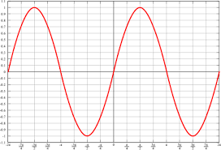
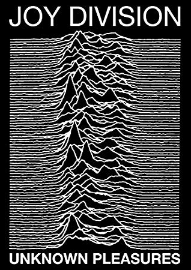
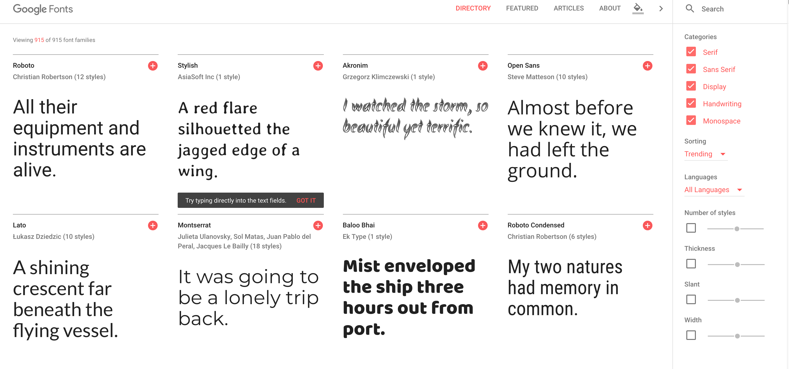
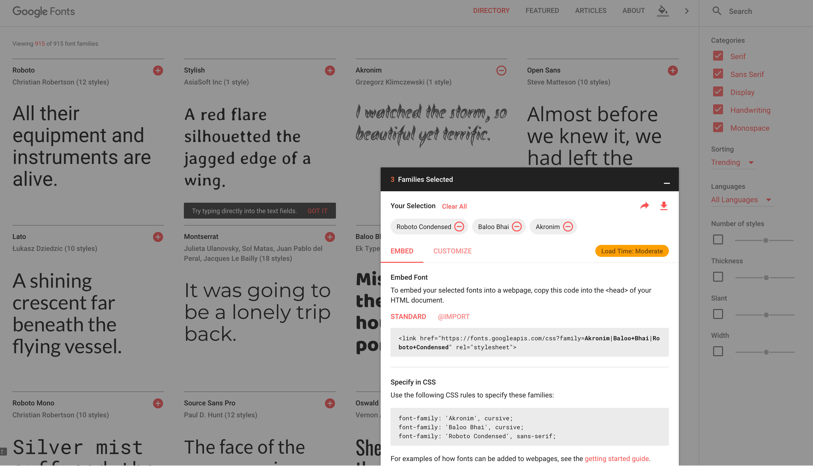

🇫🇷 [version française](https://github.com/b2renger/p5js-designing-interactive-patterns/blob/master/README.md)
🇫🇷

# p5js-designing-interactive-patterns

P5js is a project derived from Processing, which is a programming language based on Java, oriented towards graphical and interactive creation. P5js aims to transpose the spirit of Processing to the web and thus to the JavaScript language. It is a framework that is easily accessible for beginners, with comprehensive documentation and an active community.

P5js offers integration into an HTML5 canvas with a wide range of functions for drawing and animation, possibilities for interaction through various human-machine interfaces (keyboard, mouse, webcam, microphone...), or even with the components of a web page and partial but developing support for WebGL.

You can consult [the p5js reference](https://p5js.org/reference/) which will describe with examples the entire set of p5js functions, but do not hesitate to also consult [the examples](https://p5js.org/examples/) - which may, however, be a bit more complicated to understand.

Numerous libraries offer new possibilities, but p5js can naturally interface with any JavaScript libraries.

The techniques described here are accessible to beginners, but it is necessary to know the basics of programming with p5js in a development environment of your choice, meaning, for example, having read and integrated the first three paragraphs of this [introductory resource](https://github.com/b2renger/Introduction_p5js):

- [How to work with p5js](https://github.com/b2renger/Introduction_p5js#p5js_tools)
- [The basic principles](https://github.com/b2renger/Introduction_p5js#bases)
- [Drawing with the mouse](https://github.com/b2renger/Introduction_p5js#dessiner)

The first link also has *resources* and *references* sections at the end of the page that point towards other tutorials or libraries and towards artistic and/or playful projects involving web technologies.

You can find all the code from the different examples on this [GitHub repository](https://github.com/b2renger/p5js-designing-interactive-patterns).


##  1. <a name='Content'></a>Content

<!-- vscode-markdown-toc -->
1. [Content](#Content)
2. [The major differences between Processing and p5js](#ThemajordifferencesbetweenProcessingandp5js)
	* 2.1. [Theoretical differences](#Theoreticaldifferences)
	* 2.2. [In Practice](#InPractice)
3. [A responsive web page - Drawing a circle that stays in the middle](#Aresponsivewebpage-Drawingacirclethatstaysinthemiddle)
4. [Drawing a grid - long live for loops!](#Drawingagrid-longliveforloops)
	* 4.1. [First grid](#Firstgrid)
	* 4.2. [A grid of circles](#Agridofcircles)
		* 4.2.1. [a little interaction change the size of the boxes](#alittleinteractionchangethesizeoftheboxes)
		* 4.2.2. [center circles in our boxes](#centercirclesinourboxes) - [**DEMO**](https://b2renger.github.io/p5js-designing-interactive-patterns/sketch_01_b_responsive_grid/)
		* 4.2.3. [a grid centered in our page](#agridcenteredinourpage) - [**DEMO**](https://b2renger.github.io/p5js-designing-interactive-patterns/sketch_01_c_responsive_grid/)
5. [A little interaction with the mouse](#Alittleinteractionwiththemouse)
	* 5.1. [A grid of circles that change size according to mouse position](#Agridofcirclesthatchangesizeaccordingtomouseposition) - [**DEMO**](https://b2renger.github.io/p5js-designing-interactive-patterns/sketch_02_a_interactive_grid/)
	* 5.2. [A grid of concentric circles](#Agridofconcentriccircles) - [**DEMO**](https://b2renger.github.io/p5js-designing-interactive-patterns/sketch_02_b_triple-for/)
	* 5.3. [A grid of interactive lines](#Agridofinteractivelines) - [**DEMO**](https://b2renger.github.io/p5js-designing-interactive-patterns/sketch_02_d_triple-for-lines/)
	* 5.4. [A grid of concentric circles 2](#Agridofconcentriccircles2) - - [**DEMO**](https://b2renger.github.io/p5js-designing-interactive-patterns/sketch_02_c_triple-for/)
6. [Writing conditions with if()](#Writingconditionswithif)
	* 6.1. [if-else and random() - randomSeed()](#if-elseandrandom-randomSeed) - [**DEMO**](https://b2renger.github.io/p5js-designing-interactive-patterns/sketch_03_a_if/)
	* 6.2. [Variation 1 with a nested if](#Variation1withanestedif) - [**DEMO**](https://b2renger.github.io/p5js-designing-interactive-patterns/sketch_03_b_if/)
	* 6.3. [Variation 2 with if - else if](#Variation2withif-elseif) - [**DEMO**](https://b2renger.github.io/p5js-designing-interactive-patterns/sketch_03_c_if/)
7. [Make some Noise !](#MakesomeNoise)
	* 7.1. [noise 1 dimension](#noise1dimension) - [**DEMO**](https://b2renger.github.io/p5js-designing-interactive-patterns/sketch_04_a_noise-1D/)
	* 7.2. [noise 2 dimensions](#noise2dimensions) - [**DEMO**](https://b2renger.github.io/p5js-designing-interactive-patterns/sketch_04_b_noise-2D/)
	* 7.3. [noise 3 dimensions](#noise3dimensions) - [**DEMO**](https://b2renger.github.io/p5js-designing-interactive-patterns/sketch_04_c_noise-3D/)
	* 7.4. [Noise and polar coordinates](#Noiseandpolarcoordinates) - [**DEMO**](https://b2renger.github.io/p5js-designing-interactive-patterns/sketch_04_d_noise-circle-rad-angle/)
	* 7.5. [Noise and symetries](#Noiseandsymetries) - [**DEMO**](https://b2renger.github.io/p5js-designing-interactive-patterns/sketch_04_e_noise-symetric/)
	* 7.6. [Symmetrical noise and polar coordinates](#Symmetricalnoiseandpolarcoordinates) - [**DEMO**](https://b2renger.github.io/p5js-designing-interactive-patterns/sketch_04_f_noise-circle-symetric/)
	* 7.7. [Asymmetric noise and polar coordinates](#Asymmetricnoiseandpolarcoordinates) - [**DEMO**](https://b2renger.github.io/p5js-designing-interactive-patterns/sketch_04_g_noise-circle-asymetric/)
	* 7.8. [Interlude unknown pleasures](#Interludeunknownpleasures) - [**DEMO**](https://b2renger.github.io/p5js-designing-interactive-patterns/sketch_04_h_joydivision/)
8. [Rotate-translate](#Rotate-translate)
	* 8.1. [Un exemple basique](#Unexemplebasique) - [**DEMO**](https://b2renger.github.io/p5js-designing-interactive-patterns/sketch_05_a_rotate/)
	* 8.2. [Using fonts](#Usingfonts) - [**DEMO1**](https://b2renger.github.io/p5js-designing-interactive-patterns/sketch_05_b_rotate_typo_reflection/) - [**DEMO2**](https://b2renger.github.io/p5js-designing-interactive-patterns/sketch_05_c_rotate_typo_polar/)
9. [Drawing in layers](#Drawinginlayers) - [**DEMO 1**](https://b2renger.github.io/p5js-designing-interactive-patterns/sketch_06_a_layers_half-cirdles/) - [**DEMO 2**](https://b2renger.github.io/p5js-designing-interactive-patterns/sketch_06_b_layers_supperpositions/index.html)

<!-- vscode-markdown-toc-config
	numbering=true
	autoSave=true
	/vscode-markdown-toc-config -->
<!-- /vscode-markdown-toc -->


##  2. <a name='ThemajordifferencesbetweenProcessingandp5js'></a>The major differences between Processing and p5js

###  2.1. <a name='Theoreticaldifferences'></a>Theoretical differences

I recommend starting by reading the [basic principles](https://github.com/b2renger/Introduction_p5js#les-principes-de-bases) to understand how a web page is structured between HTML files and JavaScript files and which lays down the fundamental principles of Processing and thus of p5js.

In reality, Processing and p5js are both very similar and very different. In Processing, we write **Java** code, and in p5js, we write **JavaScript**. Java and JavaScript are fundamentally different languages:

- Java is compiled (when you click the run button, your code is "read" by your computer, and any errors are presented to you, but more importantly, it is transformed at that moment into executable instructions = machine language by your processor, etc.) JavaScript is an interpreted language: it is essentially composed of text and is not precompiled before its execution.

- Java is executed by a virtual software layer, JavaScript is executed directly by the browser(s).

- Java is a typed language (there are data types: *float*, *int*, *String*, *boolean*, etc.), JS does not have types (all these types are replaced by a keyword *let*).

In practice, we will focus on a subset of JavaScript with the discovery of p5js, just as we focus on a subset of Java when writing Processing code.

[**home**](#content)<br>

###  2.2. <a name='InPractice'></a>In Practice

1- Types: no more *float*, etc., but *let*

2- The [size()](https://processing.org/reference/size_.html) function, which allows specifying the size of our window, is replaced by the [createCanvas()](https://p5js.org/reference/#/p5/createCanvas) function. Indeed, we no longer create a window but a [**canvas**](https://en.wikipedia.org/wiki/Canvas_element) on a web page. The canvas is an HTML element introduced with HTML5 that allows displaying dynamic images through the execution of JavaScript scripts.

3- Semicolons at the end of each instruction are no longer necessary! But we will still keep them...

4- The "debugging" process related to the console (the part where error messages are displayed in red) is also a bit different. To access potential error messages, you have to right-click on our page and click on "Inspect," then click on the "console" tab.
To display messages from our code in this same console, instead of using *println("my message to display")*, we will use *console.log("my message to display")*

Of course, there are other differences, but they are less impactful. The use of basic Processing functions that you already know are the same or differ minimally:

[ellipse()](https://p5js.org/reference/#/p5/ellipse), [line()](https://p5js.org/reference/#/p5/line), [rect()](https://p5js.org/reference/#/p5/rect), [background()](https://p5js.org/reference/#/p5/background), [colorMode()](https://p5js.org/reference/#/p5/colorMode), [fill()](https://p5js.org/reference/#/p5/fill), [stroke()](https://p5js.org/reference/#/p5/stroke) etc.

We will now focus more directly on the code and the setup of our first programs. However, we must keep in mind that our programs are executed in a browser and the user can change the size of their window at any time, and we do not want this to change the outcome too much graphically: we will therefore have to work in a **responsive** manner and thus express the coordinates of our geometric shapes based on the size of our canvas.

[**home**](#content)<br>

##  3. <a name='Aresponsivewebpage-Drawingacirclethatstaysinthemiddle'></a>A responsive web page - Drawing a circle that stays in the middle

Everything is in the title!

The first step, as previously mentioned, is to create a **canvas** that will take up all the available space on our web page. Instead of using the *size()* function from Processing, we will use the [**createCanvas()**](https://p5js.org/reference/#/p5/createCanvas) function. To make this canvas occupy the entire size of our browser window, we will pass it two variables: [**windowWidth**](https://p5js.org/reference/#/p5/windowWidth) and [**windowHeight**](https://p5js.org/reference/#/p5/windowHeight). As specified in the documentation, these are system variables, meaning they exist and are accessible everywhere in our JavaScript code and do not need to be declared.


```javascript
function setup() {
  createCanvas(windowWidth, windowHeight); 
  // createCanvas(800, 600);
  background(180);
}
function draw(){
  background(180);
}
```
By typing or copying and pasting this small snippet of code, when you click the *play* button, you will see a magnificent gray page covering the entire surface of your window appear.

Notice that if you resize your window, scroll bars will appear on the right and bottom for you to navigate your page. This indicates that your canvas is larger than the web page in which it is displayed. Indeed, the canvas is created in the `setup()` function, and thus only once when the page is first displayed or refreshed, retaining its initial size.

You can try commenting out the line `createCanvas(windowWidth, windowHeight);` by placing "//" in front to deactivate it (lines of code preceded by two slashes are not executed by our browser) and uncommenting the line below it (by removing the two slashes preceding it). Then, you will see a gray square smaller than our browser window that also does not change size when the page is resized.

Therefore, we need to be capable of resizing our canvas to the size of our window when the user changes its size. The [**windowResize()**](https://p5js.org/reference/#/p5/windowResized) function is precisely made for this! It allows for executing the code located between its braces '{}' when the user resizes their browser window. We then only need to call the [**resizeCanvas()**](https://p5js.org/reference/#/p5/resizeCanvas) function to resize our canvas to the new size of our window by calling the **windowWidth** and **windowHeight** variables again, which have changed value as a result of our user's action.


```javascript
function setup() {
  createCanvas(windowWidth, windowHeight); 
  // createCanvas(800, 600);
  background(180);
}
function draw(){
    
}

function windowResized() {
  resizeCanvas(windowWidth, windowHeight);
}
```
So this time it's good! Our canvas stays the size of our browser window.
We will now make it so that we draw a circle in the middle of our canvas and try to make sure it stays in the middle.

As a reminder, the coordinate system of processing places the origin of our reference in the upper left corner of our canvas:

https://www.openprocessing.org/sketch/388459

If we want to draw a circle in the middle of our window and it stays in the middle, we must therefore express its coordinates as a function of [**width**](https://p5js.org/reference/#/p5/width) and [**height**](https://p5js.org/reference/#/p5/height) which are the width and height of our drawing area.

By adding a call to the [**ellipse()**](https://p5js.org/reference/#/p5/ellipse) function in the draw(), we can make sure that our circle stays in the middle of our window regardless of its size:


``` javascript
fill(255);
ellipse(width*0.5, height*0.5, 50, 50);
```
If we want our drawings/patterns to be responsive and keep a similar aspect ratio regardless of the size of our window, we must be able to express all the coordinates of our shapes using percentages (i.e. by multiplying either *width* or *height* by a value between 0 and 1)

[**home**](#contenu)<br>

##  4. <a name='Drawingagrid-longliveforloops'></a>Drawing a grid - long live for loops!

###  4.1. <a name='Firstgrid'></a>First grid

We are going to use [**for()**](https://processing.org/reference/for.html) loops. For loops are very useful for automating an action that needs to be repeated several times.

The generic syntax of a for loop looks like this:


```javascript
for (/* write the conditions that govern execution */) {
  // write the code to execute if the conditions are met
}

```
The **execution conditions** are specified in three steps separated by semicolons, which must be specified between the parentheses following the keyword **for**:
- declare and initialize a variable
- perform a test on this variable to determine if the code inside the brackets should be executed
- manipulate the variable for the next execution

For example, if you write this in the setup:

```javascript
for (let i = 0; i < 10; i++) {
  console.log(i);
}
```
You will repeat the action "println(i)" ten times; this will result in printing the value of the variable i in the console as long as it is less than 10.

Here's what the computer will understand:

First iteration

- i is equal to 0

- 0 is less than 10

- I print i (i.e., 0) in the console

- I add 1 to i

Second iteration

- i is equal to 1 (from the previous iteration)
- 1 is less than 10
- I print i (i.e., 1) in the console
- I add 1 to i (which will now be equal to 2)

(..)

Eleventh iteration
- i is equal to 10
- 10 is no longer less than 10
- I exit the loop and execute the next line of code located after the closing curly brace.

By manipulating the initialization, ending, and incrementation conditions of the loop, we will be able to create many visual effects. Let's start by trying to draw vertical lines that scan the screen every 50 pixels.

In the draw() function, you can type this loop:

```js
for (let i = 0 ; i < width ; i += 50){
    line(i,0,i,height);
}
```

You will obtain something like this:


To create a series of horizontal lines spaced 50 pixels apart, you can modify the previous loop as follows:

```js
for (let i = 0; i <= height; i += 50) {
  line(0, i, width, i);
}
```
This will draw a line from the left edge of the canvas to the right edge, at every 50 pixel interval along the vertical axis.

To create a grid with a spacing of 100 pixels, you can combine two for loops, one inside the other:


```js
for (let i = 0; i <= width; i += 100) {
  for (let j = 0; j <= height; j += 100) {
    line(i, 0, i, height);
    line(0, j, width, j);
  }
}
```
This will draw a vertical line at every 100 pixel interval along the horizontal axis, and a horizontal line at every 100 pixel interval along the vertical axis. The coordinates (i, j) calculated by the nested loops give the top left corner of each grid square.

[**home**](#contenu)<br>

###  4.2. <a name='Agridofcircles'></a>A grid of circles 

We'll now try to draw a grid of circles:


```javascript
for (let i = 0; i <= width; i += 100) {
    for (let j = 0; j <= height; j+= 100) {
        ellipse(i,j,100,100);
        line(i,0,i,height);
        line(0,j,width,j);
    }
}
```
Since the ellipse() function takes the circle's center coordinates as parameters, our circle is drawn around each intersection.


In this example, our circles have a fixed size of 100 pixels. We're now going to make these circles change size each time we click the mouse.

[**home**](#contenu)<br>

####  4.2.1. <a name='alittleinteractionchangethesizeoftheboxes'></a>a little interaction change the size of the boxes

First of all, we'll need to create a variable which will be the size of each slot, and which will therefore correspond to the value by which we increase each variable in the for loop. This variable could be called "slotSize", for example, and we'll initialize it with a value of 100.

Before setup() (so that our variable is available throughout our program), we can write this line, which is used to declare and initialize a variable.

```javascript
let slotSize = 100;
```
We're now going to use our variable in our for loop (found in draw()) to adjust the size of our boxes and ellipse to the value contained in the slotSize variable (here 100 for now, but we'll be able to change it later) - just replace "100" with "slotSize" in our two nested for loops:

```javascript
for (let i = 0; i <= width; i += slotSize) {
    for (let j = 0; j <= height; j+= slotSize) {
        ellipse(i,j,slotSize,slotSize);
        line(i,0,i,height);
        line(0,j,width,j);
    }
}
```
Now all we need to do is manipulate our slotSize variable and give it new values: we're going to make it change to a random value every time we press the mouse. To do this, we simply use the function [**mousePressed()**](https://p5js.org/reference/#/p5/mousePressed): each time we press the mouse, the code between the braces will be executed. We then want to use [**random()**](https://p5js.org/reference/#/p5/random) to assign our "slotSize" variable a new random value between a minimum and a maximum value.

```
function mousePressed() {
    slotSize = random(10, 200);
}
```
Please note that mousePressed() is a new function and must therefore be located outside setup() and draw().


[**home**](#contenu)


####  4.2.2. <a name='centercirclesinourboxes'></a>center circles in our boxes

We're now going to make sure that our circles are centered in our boxes. We're going to manipulate the start and stop conditions of our loops so that "i" and "j" give us the center of the boxes rather than the top left corner.


Our boxes are square and of "slotSize", so we simply add half of slotSize to i and j to obtain the center of each box.

```javascript
fill(255);
for (let i = 0; i <= width ; i += slotSize) {
    for (let j = 0; j <= height ; j += slotSize) {
        line(i, 0, i, height);
        line(0, j, width, j);
    }
}

for (let i = slotSize / 2; i <= width - slotSize / 2; i += slotSize) {
    for (let j = slotSize / 2; j <= height - slotSize / 2; j += slotSize) {
        ellipse(i, j, slotSize, slotSize);  
    }
}
```

Notice that when you resize your window, some circles appear or disappear at the border and our grid is not centered. We'll try to remedy this.

You can find the program [here].(https://b2renger.github.io/p5js-designing-interactive-patterns/sketch_01_b_responsive_grid/)

And the code : https://github.com/b2renger/p5js-designing-interactive-patterns/tree/master/sketch_01_b_responsive_grid

[**home**](#contenu)

####  4.2.3. <a name='agridcenteredinourpage'></a>a grid centered in our page

There are several options here: 

- either we know the number of boxes we want to display in width and height and we calculate the size of our increments (the 'i = i+100' part) so that the right number of boxes is created.

- or we know the size of the boxes we want to display and calculate the number of boxes according to the size of the window.

Given what we've achieved so far, we'll opt for the second option. However, the description of what we have to do is not entirely accurate. There's no guarantee that the random number we'll come across when we click the mouse will be a multiple of our window size... especially as this number is potentially a decimal point and our user can change the window size as he sees fit ...
so it's a little more complicated ...

We need to calculate the maximum number of boxes we can fit in our window, based on the size of the boxes and the size of our window.

Depending on the result of this calculation, we'll be left with an empty space that's less than the size of a square. This value (in pixels) of the remaining space can be divided by two to create a top and bottom margin and a left and right margin.

We therefore need to start by declaring global variables (at the very top of our program) outside any braces

```javascript
let marginX;
let marginY;
```

Next, in setup(), we need to calculate the size of our margins. We need to divide the width and height of our window by the size of our boxes, respectively. Take the integer part of this division and multiply it by the size of each of our boxes. If we subtract this result from each dimension of our window, we obtain in pixels the space remaining once we've displayed the maximum number of squares, i.e. twice our margin.

```javascript
marginX = windowWidth - int((windowWidth / slotSize)) * slotSize;
marginY = windowHeight - int((windowHeight / slotSize)) * slotSize;
```
This calculation must be performed in setup() so that our grid is displayed correctly when our page loads, and it must be repeated every time our page changes size (i.e. in the *windowResized()* function after the *resizeCanvas()* call), as well as when we change the size of our boxes (i.e. in the *mousePressed()* function after the call to *random()* to specify a new box size).

We now need to use these two new variables in the start and stop conditions of our for loop:

```javascript
for (let i = marginX / 2 + slotSize / 2; i < width - marginX / 2; i += slotSize) {
    for (let j = marginY / 2 + slotSize / 2; j < height - marginY / 2; j += slotSize) {
        fill(255)
        rect(i, j, slotSize, slotSize);
        fill(255)
        ellipse(i, j, slotSize, slotSize);        
    }
}
```

And now we've finally arrived at the result of the gif displayed earlier. From now on, the code you'll be writing will mainly be inside these two for loops; there's a lot you can do. The code we've written so far will be your starting point for creating geometrical tessellations, each one more beautiful than the last!


This code will be the basis for most of the programs we create:

```javascript
let slotSize = 100;
let marginX;
let marginY;

function setup() {
    createCanvas(windowWidth, windowHeight);
    background(180);
    pixelDensity(1);

    marginX = windowWidth - int((windowWidth / slotSize)) * slotSize;
    marginY = windowHeight - int((windowHeight / slotSize)) * slotSize;
}


function draw() {
    background(180)
    for (let i = marginX / 2 + slotSize / 2; i < width - marginX / 2; i += slotSize) {
        for (let j = marginY / 2 + slotSize / 2; j < height - marginY / 2; j += slotSize) {
            // code here

        }
    }
}

function mousePressed(){
    slotSize = random(10, 200);
    marginX = windowWidth - int((windowWidth / slotSize)) * slotSize;
    marginY = windowHeight - int((windowHeight / slotSize)) * slotSize;
}

function windowResized() {
    resizeCanvas(windowWidth, windowHeight);
    marginX = windowWidth - int((windowWidth / slotSize)) * slotSize;
    marginY = windowHeight - int((windowHeight / slotSize)) * slotSize;
}
```

You can find the program [here].(https://b2renger.github.io/p5js-designing-interactive-patterns/sketch_01_c_responsive_grid/)

Aswell as the code : https://github.com/b2renger/p5js-designing-interactive-patterns/tree/master/sketch_01_c_responsive_grid

[**home**](#contenu)

##  5. <a name='Alittleinteractionwiththemouse'></a>A little interaction with the mouse

###  5.1. <a name='Agridofcirclesthatchangesizeaccordingtomouseposition'></a>A grid of circles that change size according to mouse position

Our next program is very simple, based on the code we saw earlier:


The idea here is to draw a circle in each box and match its size to the distance separating the mouse from the center of each circle: if the mouse is close, the circle is large, if it's far away, the circle is small.

Drawing circles in each box is easy: just call the function [ellipse()](https://p5js.org/reference/#/p5/ellipse) inside the double for loop, using the variables i and j for the coordinates of the center of each ellipse, which vary as the loops are executed.

```javascript
for (let i = marginX / 2 + slotSize / 2; i < width - marginX / 2; i += slotSize) {
        for (let j = marginY / 2 + slotSize / 2; j < height - marginY / 2; j += slotSize) {
            // code here
            ellipse(i,j, slotSize, slotSize);                                                                              
        }
}
```

To calculate the distance there's the function [**dist()**](https://p5js.org/reference/#/p5/dist), which calculates the distance between two points.

We need to calculate the distance between the mouse and each of the points on our grid. This will have to be done for each square, so we'll create a variable called 'd' to store this distance.

```javascript
for (let i = marginX / 2 + slotSize / 2; i < width - marginX / 2; i += slotSize) {
        for (let j = marginY / 2 + slotSize / 2; j < height - marginY / 2; j += slotSize) {
            // code here
            let d = dist(mouseX,mouseY,i,j)
            ellipse(i,j, slotSize, slotSize);                       
        }
}
```

Now all we need to do is calculate the size of our circles as a function of the calculated distance. To do this, we'll use a rule of three or proportionality rule, calculated using the function [**map()**](https://p5js.org/reference/#/p5/map). **map()** takes 5 parameters, the first of which is the value we wish to transform, the next two are the minimum and maximum values this value can take, and the last two are the minimum and maximum values we wish to output.

The minimum output values we want are "5" pixels and "slotSize" pixels: so that if the mouse is right on the center of a circle, it takes up the maximum possible size in its slot.

The minimum distance between the mouse and the center of a circle is of course zero, while the maximum distance can be resolved by a simple application of the Pythagorean theorem in our drawing window. The greatest possible distance in our window is the size of a diagonal (if our mouse is at the top left, we want our point at the bottom right to be as small as possible). So we need to calculate the diagonal of our window:

```javascript
let dmax = sqrt(width*width + height*height);
```

We can now apply our rule of three or "mapping" - paying attention to the direction in which we want it to apply (when the distance is 0, the circle must be of maximum size):

```javascript
let s = map(d, 0, dmax, slotSize, 1)
```

You can also combine the calculation of 'd', 'dmax' and 's' in a single line if you wish:

```javascript
let s = map(dist(i,j,mouseX,mouseY), 0, sqrt(width*width + height*height), slotSize, 1)
```

To summarize, here's the content of the **draw()** to obtain the result shown in the gif above:

```javascript
background(0)
for (let i = marginX / 2 + slotSize / 2; i < width - marginX / 2; i += slotSize) {
    for (let j = marginY / 2 + slotSize / 2; j < height - marginY / 2; j += slotSize) {
        let s = map(dist(i, j, mouseX, mouseY), 0, sqrt(width * width + height * height), slotSize, 1);
        ellipse(i, j, s, s);
    }
}
```

You can find the program [here].(https://b2renger.github.io/p5js-designing-interactive-patterns/sketch_02_a_interactive_grid/)

And the code : https://github.com/b2renger/p5js-designing-interactive-patterns/tree/master/sketch_02_a_interactive_grid

[**home**](#contenu)

###  5.2. <a name='Agridofconcentriccircles'></a>A grid of concentric circles

Since the more for loops we have, the more fun we have! we're going to add a third for loop inside our two previous loops. This means that for each square drawn, we'll repeat the same action several times.


Starting from more or less the same basis as above, we'll take care to modify the filling of our shapes so that we no longer have any with [**noFill()](https://p5js.org/reference/#/p5/noFill) - exactly as in processing - and have a white shape outline with [**stroke()**](https://p5js.org/reference/#/p5/stroke), also as in processing.

```javascript
background(0)
noFill();
stroke(255)
for (let i = marginX / 2 + slotSize / 2; i < width - marginX / 2; i += slotSize) {
    for (let j = marginY / 2 + slotSize / 2; j < height - marginY / 2; j += slotSize) {
    
           
    }
}
```
Within these two for loops, we can now add a third! This third loop will enable us to draw circles with the same center, but whose size decreases with each iteration of the loop:

```javascript
for (let k = slotSize; k > 0; k = k - 10) {
    ellipse(i , j, k, k);                                                           
}
```
We're now going to make sure that this number of co-centric circles can change at random when we press the mouse.

We'll therefore create a new variable at the very top of our program (outside setup() and draw())

```javascript
let niterations = 5;
```

and we're going to use it to control the increment of "k" in our for loop. The number of times we'll repeat the action is "niterations", so we need to reduce the size of our "slotSize/niterations" ellipse.

```javascript
for (let k = slotSize; k > 0; k = k - slotSize/niterations) {
    ellipse(i , j, k, k);                                                           
}
```

Now we can call up the **random()** function inside our **mousePressed()** function, but this time we want an integer, whereas random() returns comma (or float) numbers by default. To remedy this, we simply take the integer part of the number returned by random() using the function [**int()**](https://p5js.org/reference/#/p5/int).

```javascript
niterations = int(random(2, 20))
```
To achieve the result shown in the gif, all we need to do now is manipulate the size of the circles according to the position of the mouse in the window. This size must change for each circle, so we're going to calculate it inside the three loops.

In fact, we're not going to calculate the size of each ellipse directly, but rather a multiplying coefficient by which we'll multiply the size already pre-calculated by our for('k') loop.

```javascript
let s = map(mouseX, 0, width, 0.5, 5);
ellipse(i , j , k *s, k*s);
```

Here is the complete draw() code represented by the gif above.
```javascript
background(0);
noFill();
stroke(255);
for (let i = marginX / 2 + slotSize / 2; i < width - marginX / 2; i += slotSize) {
    for (let j = marginY / 2 + slotSize / 2; j < height - marginY / 2; j += slotSize) {
        for (let k = slotSize; k > 0; k = k - slotSize/niteration) {
            let s = map(mouseX, 0, width, 0.5, 5);
            ellipse(i , j , k *s, k*s);
         }
    }
}
```
You can find the programme [here](https://b2renger.github.io/p5js-designing-interactive-patterns/sketch_02_b_triple-for/)

And the code : https://github.com/b2renger/p5js-designing-interactive-patterns/tree/master/sketch_02_b_triple-for

[**home**](#contenu)

###  5.3. <a name='Agridofinteractivelines'></a>A grid of interactive lines

We are now going to work on creating this pattern:


    
This pattern is created by linking each corner of each square to a point moving inside each square. The position of this point depends on the position of the mouse in the window: when the mouse is on the right of the window, then the moving point is on the right of each of the squares, when it is at the top of the window, the point is also at the top of each square, and so on.

So we want to map (using the map() function!) the position of our mouse as it moves around the window to the position of the moving point as it moves around its box.  

We therefore need to calculate an offset. In the same way as before, we are not going to calculate the offset directly but rather a coefficient, i.e. a value that we are going to multiply by another to obtain this offset.

We want to have an offset centred around zero when our mouse moves across the width or height.

```javascript
let xOffset = map(mouseX, 0, width, -0.5, 0.5)
let yOffset = map(mouseY, 0, height, -0.5, 0.5)
```

As this calculation is the same for each square, we can do it in the draw() function just before our for loops.

Now all we need to do is draw our lines using the [**line()** function](https://p5js.org/reference/#/p5/line). We need to define two points for each line: the corners of each square and the moving point.

The moving point always has the coordinates :

```
(i + xOffset * (slotSize), j + yOffset * (slotSize))
```

(i,j) being the co-ordinates of the centre of a square, we add to or subtract from them half the size of our square, depending on the value taken by 'xOffset' and 'yOffset', which are themselves defined by the position of the mouse in the window.

The coordinates of the top left-hand points of each cell (offset by half the size of the cell on the x-axis and y-axis)

```
(i - slotSize * 0.5, j - slotSize * 0.5)
```

It is then quite easy to calculate the coordinates of each of the corners of each square:

- top right corner :
```
(i + slotSize * 0.5, j - slotSize * 0.5)
```

- bottom right corner :
```
(i + slotSize * 0.5, j + slotSize * 0.5)
```

- bottom left corner :
```
(i - slotSize * 0.5, j + slotSize * 0.5)
```

All that remains is to draw the four lines:

```javascript
for (let i = marginX / 2 + slotSize / 2; i < width - marginX / 2; i += slotSize) {
    for (let j = marginY / 2 + slotSize / 2; j < height - marginY / 2; j += slotSize) {

        let xOffset = map(mouseX, 0, width, -0.5, 0.5)
        let yOffset = map(mouseY, 0, height, -0.5, 0.5)
        line(i + xOffset * (slotSize), j + yOffset * (slotSize),
                i - slotSize * 0.5, j - slotSize * 0.5);
        line(i + xOffset * (slotSize), j + yOffset * (slotSize),
                i + slotSize * 0.5, j + slotSize * 0.5);
        line(i + xOffset * (slotSize), j + yOffset * (slotSize),
                i + slotSize * 0.5, j - slotSize * 0.5);
        line(i + xOffset * (slotSize), j + yOffset * (slotSize),
                i - slotSize * 0.5, j + slotSize * 0.5);

    }
}
```

You can find the programme [here](https://b2renger.github.io/p5js-designing-interactive-patterns/sketch_02_d_triple-for-lines/)

Aswell as the code : https://github.com/b2renger/p5js-designing-interactive-patterns/tree/master/sketch_02_d_triple-for-lines


[**home**](#contenu)

###  5.4. <a name='Agridofconcentriccircles2'></a>A grid of concentric circles 2

We are now going to combine the two previous effects: we are going to manipulate the position of the centres of the co-centric circles to give a false 3D effect created from real 2D.


Let's drop the part about manipulating the diameter of our circles:

```javascript
background(0);
noFill();
stroke(255);
for (let i = marginX / 2 + slotSize / 2; i < width - marginX / 2; i += slotSize) {
    for (let j = marginY / 2 + slotSize / 2; j < height - marginY / 2; j += slotSize) {
        for (let k = slotSize; k > 0; k = k - slotSize/niteration) {
            ellipse(i , j , k , k);
         }
    }
}
```

In the same way as above, we will calculate an offset: 

```javascript
let xOffset = map(mouseX, 0, width, -0.5, 0.5)
let yOffset = map(mouseY, 0, height, -0.5, 0.5)
```

If we look closely at our animation, we can see that the offset is greater for the smaller circles - those close to the centre - and non-existent for the larger circles.

To be able to do this, we need to ensure that when the size of our circle is maximum, the value by which we multiply our offset is zero: to cancel out the offset. And conversely, when our circle size is minimal, this value must be greater to get the full effect of the offset; this value is therefore 


```javascript
(slotSize - k)
```

All that remains is to apply the results of our calculations to the positions of the centres of our circles.

```javascript
let centerX = i + xOffset * (slotSize-k);
let centerY = j + yOffset * (slotSize-k);

```

and voilà !

```javascript
let xOffset = map(mouseX, 0, width, -0.5, 0.5)
let yOffset = map(mouseY, 0, height, -0.5, 0.5)
let centerX = i + xOffset * (slotSize-k);
let centerY = j + yOffset * (slotSize-k);
ellipse(centerX,centerY, k, k);

```

```javascript
background(0);
noFill();
stroke(255);
for (let i = marginX / 2 + slotSize / 2; i < width - marginX / 2; i += slotSize) {
    for (let j = marginY / 2 + slotSize / 2; j < height - marginY / 2; j += slotSize) {
        for (let k = slotSize; k > 0; k = k - slotSize/niteration) {
            let xOffset = map(mouseX, 0, width, -0.5, 0.5)
            let yOffset = map(mouseY, 0, height, -0.5, 0.5)
            let centerX = i + xOffset * (slotSize-k);
            let centerY = j + yOffset * (slotSize-k);
            ellipse(centerX,centerY, k, k);
         }
    }
}
```

You can find the programme [here](https://b2renger.github.io/p5js-designing-interactive-patterns/sketch_02_c_triple-for/)

And the code : https://github.com/b2renger/p5js-designing-interactive-patterns/tree/master/sketch_02_c_triple-for


[**home**](#contenu)

##  6. <a name='Writingconditionswithif'></a>Writing conditions with if()

We're now going to stick to the same principle and see how a very simple rule can give us a multitude of relatively varied designs: the principle is that in each square we can choose to draw one of the two possible diagonals. 


As usual, we're going to start with our basic code

```javascript
let slotSize = 100;
let marginX;
let marginY;

function setup() {
    createCanvas(windowWidth, windowHeight);
    background(180);
    pixelDensity(1);

    marginX = windowWidth - int((windowWidth / slotSize)) * slotSize;
    marginY = windowHeight - int((windowHeight / slotSize)) * slotSize;
}


function draw() {
    background(180)
    for (let i = marginX / 2 + slotSize / 2; i < width - marginX / 2; i += slotSize) {
        for (let j = marginY / 2 + slotSize / 2; j < height - marginY / 2; j += slotSize) {
            // code here

        }
    }
}

function mousePressed(){
    slotSize = random(10, 200);
    marginX = windowWidth - int((windowWidth / slotSize)) * slotSize;
    marginY = windowHeight - int((windowHeight / slotSize)) * slotSize;
}

function windowResized() {
    resizeCanvas(windowWidth, windowHeight);
    marginX = windowWidth - int((windowWidth / slotSize)) * slotSize;
    marginY = windowHeight - int((windowHeight / slotSize)) * slotSize;
}
```

As a reminder, this code allows us to obtain a grid that reacts to changes in the size of our window.

The code we're going to write is fairly straightforward, involving understanding how a **if()** condition is written.

As with the for loop, you need to understand the meaning of the punctuation symbols we're using: brackets are used to delimit a condition/test, and braces are used to delimit the actions to be performed if our condition is true:

```javascript
if( my-condition-is-true ) { 
    // I execute the code written here 
}
```

An **if(){}** can be followed by an **else{}** in order to define another action to be performed if the condition is false.

```javascript
if( my-condition-is-true ) { 
    // I execute the code written here. 
} else{ 
    // I execute this code instead 
}
```

Conditions can also be chained:

```javascript
if( my-condition-is-true ) {
    // I execute the code written here.
}
else if( another-condition-is-true){
    // I run this
}
else{
    // I run this code instead
}
```

Or inside one another :

```javascript
if( my-condition-is-true ) {
    if( one-second-condition-is-true){
    // I run this
    }
    else {
    // I execute that
    }
}
else{
    // I run this code instead
}
```


[**home**](#contenu)

###  6.1. <a name='if-elseandrandom-randomSeed'></a>if-else and random() - randomSeed()

In our first example, we have just one simple condition to execute: we want to draw one or other of the diagonals at random.

In each of the boxes, we need to determine the coordinates of the corners as a function of (i,j) the point defining the centre of our box and 'slotSize', which is the size of our box.

So the first diagonal - the one starting from the bottom left corner - is written as follows: 

```javascript
line(i - slotSize / 2, j - slotSize / 2, i + slotSize / 2, j + slotSize / 2)
```

and the second - the one starting from the top left corner - is written like this:

```javascript
line(i - slotSize / 2, j + slotSize / 2, i + slotSize / 2, j - slotSize / 2)
```

All we need to do now is write a condition that allows us to draw one or other of these diagonals. To do this, we're going to run a test (i.e. write a condition) using the [**random()**](https://p5js.org/reference/#/p5/random) function that we already know. 

If we want a more or less uniform distribution of each of the two diagonals, we can simply check whether the result of 'random(1)' is greater than '0.5' or not.

```javascript
if (random(1) > 0.5) {
   
} else {
    
}
```

and draw one of the two diagonals in one case, and the other otherwise :

```javascript
 if (random(1) > 0.5) {
    line(i - slotSize / 2, j - slotSize / 2, i + slotSize / 2, j + slotSize / 2)
} else {
    line(i - slotSize / 2, j + slotSize / 2, i + slotSize / 2, j - slotSize / 2)
}
```

Unfortunately, random() by definition returns random results. This means that each time an image is calculated (each time draw() is executed) a new value is drawn at random and our image keeps changing.

In reality, randomness doesn't really exist in computing. The random() functions in various languages all return a series of pseudo-random numbers, and although this may seem disappointing, it's actually quite practical in our case (incidentally, it also allows us to recreate a specific image even when using random() extensively).


The random() function is therefore always accompanied by a [**randomSeed()**] function (https://p5js.org/reference/#/p5/randomSeed). 

This function is used to give a seed to our random() function and for a given seed random() will always return the same sequence of random numbers.

So we're going to create a new variable at the very top of our programme (outside setup() and draw()):

```javascript
let seed;
```

In *setup()*, we're going to give this variable a new initial value:

```javascript
seed = random(9999)
```

Here we use random, but to obtain a precise image we can give "seed" a precise value.

Now in *draw()* we can use this seed by calling the **randomSeed()** function. This call must be made for each frame but does not need to be made for each cell in our grid, so we can put it at the very top of our *draw()*.

```javascript
randomSeed(seed)
```

So our images now remain fixed whatever happens. To return to a more generative side, we can now change our seed each time the user presses the mouse, and so add a line of code to randomly change the seed in the *mousePressed()* function.

```javascript
function mousePressed(){
    seed = random(9999)
}
```

We can also randomise the thickness of the line when the user clicks the mouse

```javascript
strokeWeight(random(20))
```

Here is the complete generative programme:

```javascript
let slotSize = 50;
let marginX;
let marginY;
let seed

function setup() {

    createCanvas(windowWidth, windowHeight);
    background(180);

    pixelDensity(1);

    marginX = windowWidth - int((windowWidth / slotSize)) * slotSize;
    marginY = windowHeight - int((windowHeight / slotSize)) * slotSize;

    seed = random(9999)
}


function draw() {
    randomSeed(seed)
    background(0)
    noFill();
    stroke(255)
    for (let i = marginX / 2 + slotSize / 2; i < width - marginX / 2; i += slotSize) {
        for (let j = marginY / 2 + slotSize / 2; j < height - marginY / 2; j += slotSize) {

            if (random(1) > 0.5) {
                line(i - slotSize / 2, j - slotSize / 2, i + slotSize / 2, j + slotSize / 2)
            } else {
                line(i - slotSize / 2, j + slotSize / 2, i + slotSize / 2, j - slotSize / 2)
            }

        }
    }
}

function mousePressed() {
    seed = random(9999)
    slotSize = random(10, 200)
    strokeWeight(random(10))
    marginX = windowWidth - int((windowWidth / slotSize)) * slotSize;
    marginY = windowHeight - int((windowHeight / slotSize)) * slotSize;
}


function windowResized() {
    resizeCanvas(windowWidth, windowHeight);
    marginX = windowWidth - int((windowWidth / slotSize)) * slotSize;
    marginY = windowHeight - int((windowHeight / slotSize)) * slotSize;
}
```

You can find the programme [here](https://b2renger.github.io/p5js-designing-interactive-patterns/sketch_03_a_if/)

And the code : https://github.com/b2renger/p5js-designing-interactive-patterns/tree/master/sketch_03_a_if  

[**home**](#contenu)

###  6.2. <a name='Variation1withanestedif'></a>Variation 1 with a nested if 

As mentioned above, we can also nest if test into one another. We could, for example, make some lines red and others white quite easily:


```javascript 
 if (random(1) > 0.5) {
                
    if (random(1) > 0.75 ){
        stroke(255,0,0)
    }
    else {
        stroke(255)
    }
    line(i - slotSize / 2, j - slotSize / 2, i + slotSize / 2, j + slotSize / 2)
                       
} else {
    if (random(1) > 0.75 ){
        stroke(255,0,0)
    }
    else {
        stroke(255)
    }              
    line(i - slotSize / 2, j + slotSize / 2, i + slotSize / 2, j - slotSize / 2)
}

```

[Live example](https://b2renger.github.io/p5js-designing-interactive-patterns/sketch_03_b_if/)

And code : https://github.com/b2renger/p5js-designing-interactive-patterns/tree/master/sketch_03_b_if

[**home**](#contenu)

###  6.3. <a name='Variation2withif-elseif'></a>Variation 2 with if - else if

Using several conditions in sequence, it's also relatively easy to draw a labyrinth, choosing to draw only one side of each square (either the top, bottom, left or right):


```javascript
var rd = random(1)
if (rd < 0.25) {
    line(i -slotSize/2, j - slotSize/2, i-slotSize/2, j + slotSize/2); // left
} else if (rd > 0.25 && rd < 0.50) {
    line(i + slotSize/2, j-slotSize/2, i + slotSize/2, j + slotSize/2); // down
} else if (rd > 0.50 && rd < 0.75) {
    line(i-slotSize/2, j-slotSize/2, i + slotSize/2, j-slotSize/2); // up
} else if (rd > 0.25 && rd < 0.50) {
    line(i + slotSize/2, j - slotSize/2, i + slotSize/2, j + slotSize/2); //right
}
```

[Live example](https://b2renger.github.io/p5js-designing-interactive-patterns/sketch_03_c_if/)

Code : https://github.com/b2renger/p5js-designing-interactive-patterns/tree/master/sketch_04_a_noise-1D

[**home**](#contenu)

##  7. <a name='MakesomeNoise'></a>Make some Noise !

We will now look at the notion of [**noise()**](https://p5js.org/reference/#/p5/noise)

Noise is a relatively complicated concept; it is related to the notion of *random()* but is intended to generate results that are less random and closer together. In reality, noise is very much imbued with the notion of 'seed', mentioned earlier..

It was created in 1983 by [Ken Perlin](https://en.wikipedia.org/wiki/Perlin_noise) whose aim was to create an algorithm capable of reproducing natural-looking textures or surfaces. There are several types of noise, but we're going to focus on the only version implemented in p5js.

If you've read the reference, you'll understand that noise can be used in up to 3 dimensions (we'll look at this in more detail later) and that it returns values between 0 and 1. A more subtle concept to understand is that we need to "pass" at least one variable (or dimension) to the *noise()* function. The greater the difference between the different variables we pass, the closer the result will be to the *random()* function, and the smaller the difference, the smoother the result will be.

[**home**](#contenu)<br>

###  7.1. <a name='noise1dimension'></a>noise 1 dimension

We're going to start by passing just one value to our noise function, that of a time that elapses to obtain this type of result:


Using the same notion of time, we're going to create an offset in X and Y from the centre of the square using the noise function. We'll start with our usual code for a grid of boxes.

So we need to start by declaring a variable that will allow us to create a time flow. This variable will be useful in our *draw()* and we want to increase it little by little, so it needs to be global and therefore created outside any other block of code (*setup()* or *draw()*).

```javascript
let time = 0;
```

We will then increment this value at each iteration of the *draw()* function.

```javascript
time += 0.005;
```
We're going to use this value for our *noise()*, so remember that you can change it: if you increase the time more, the result will be more jerky, otherwise it will be smoother.

Now, in our double for loop, we're going to calculate two noise values for each square:

```
let n1 = noise(time)
let n2 = noise(time + 10)
```
 Here we give two different values so that the movements are not identical: we will use 'n1' to calculate a horizontal offset in relation to the centre of our square and 'n2' to calculate a vertical offset. If we had supplied the same value (i.e. 'time' for 'n2' instead of 'time+10') our offset would have been identical in X and Y for each image and we would only have been able to draw a diagonal.
 
 As usual, we'll use the *map()* function, remembering that the result of *noise()* is always between 0 and 1:
 
```javascript
let xoffset = map(n1, 0, 1, -slotSize/2, slotSize/2)
let yoffset = map(n2, 0, 1, -slotSize/2, slotSize/2)  
point(i+xoffset, j+yoffset)
```
Here we notice that the design in each of our boxes is identical. We can remedy this by using an extra dimension for our *noise()* function.

[Live example](https://b2renger.github.io/p5js-designing-interactive-patterns/sketch_04_a_noise-1D/)

Code : https://github.com/b2renger/p5js-designing-interactive-patterns/tree/master/sketch_04_a_noise-1D

[**home**](#contenu)<br>


###  7.2. <a name='noise2dimensions'></a>noise 2 dimensions

To obtain a different result in each box, we're going to pass a second argument to our noise.


```javascript
let n1 = noise(time , i) 
let n2 = noise(time + 10 , j) 
let xoffset = map(n1, 0, 1, -slotSize/2, slotSize/2)
let yoffset = map(n2, 0, 1, -slotSize/2, slotSize/2)
point(i+xoffset, j+yoffset)
```
Here we pass 'i' and 'j' directly as arguments for each of the calculations, so the result in each cell is different.

But we can achieve different results:

```javascript
let n1 = noise(time , i) 
let n2 = noise(time + 10 , i) 
```
For example, if you pass 'i' twice, the result will be the same in each column; similarly, if you pass 'j' twice, the result will be the same in each row. If you pass 'i+j' the result will be the same on each diagonal!

[Live example](https://b2renger.github.io/p5js-designing-interactive-patterns/sketch_04_b_noise-2D/)

Code : https://github.com/b2renger/p5js-designing-interactive-patterns/tree/master/sketch_04_b_noise-2D

[**home**](#contenu)<br>


###  7.3. <a name='noise3dimensions'></a>noise 3 dimensions

For this 3rd dimension, we're going to change the way we represent it. Instead of calculating the x and y offset of a point that moves and leaves a trail, we're now going to calculate the size of a rectangle that will be drawn in each square.


From a code point of view, not much changes. We still need our 'time' variable and our double for loop.

In order to draw our squares by specifying the centre rather than the top left point, we are going to call the function [**rectMode()**](https://p5js.org/reference/#/p5/rectMode) dans le *setup()*

```javascript
rectMode(CENTER)
```

In the double for loop, we can now calculate a new variable that we will use as the size of our squares, and then draw our squares:

```javascript
let s = noise(i, j, time) * slotSize*1.25
rect(i, j, s, s)
```

If we do this, the result is quite different from the result of the gif shown above. If you look more closely at the gif, you'll notice that the squares that are close to each other have similar sizes, but this isn't the case here.

Remembering how *noise()* works, this would mean that the values between successive calls to *noise()* are too far apart. This is not the case for time (as we saw earlier), but between two executions of the code inside the for loops i has potentially increased by 'slotSize' and so has j.

To obtain a result closer to the gif, we'll divide i and j by a value large enough to reduce this gap:

```javascript
let s = noise(i/100, j/100, time) * slotSize*1.25
rect(i, j, s, s)
```
Finally, in order to have a different rendering each time we press the mouse, we're going to create a variable called 'divisor' which will change value each time the user presses the mouse.

```javascript
let slotSize = 10;
let marginX;
let marginY;
let divisor = 100
let time = 0

function setup() {

    createCanvas(windowWidth, windowHeight);
    
    pixelDensity(1);

    marginX = windowWidth - int((windowWidth / slotSize)) * slotSize;
    marginY = windowHeight - int((windowHeight / slotSize)) * slotSize;
    rectMode(CENTER)
    background(0)

}


function draw() {

    background(0)
    //noFill();
    stroke(255)
    strokeWeight(1)
    time += 0.005;
    for (let i = marginX / 2 + slotSize / 2; i < width - marginX / 2; i += slotSize) {
        for (let j = marginY / 2 + slotSize / 2; j < height - marginY / 2; j += slotSize) {
            let s = noise(i/divisor, j/divisor, time) * slotSize*1.25
            rect(i, j, s, s)
        }
    }
}

function mousePressed() {
    //background(0)
    slotSize = random(5, 100)
    divisor = random(10, 1000)
    marginX = windowWidth - int((windowWidth / slotSize)) * slotSize;
    marginY = windowHeight - int((windowHeight / slotSize)) * slotSize;
}

function keyPressed(){
    background(0)
}


function windowResized() {
    resizeCanvas(windowWidth, windowHeight);
    marginX = windowWidth - int((windowWidth / slotSize)) * slotSize;
    marginY = windowHeight - int((windowHeight / slotSize)) * slotSize;
}
}
```
[Live Example](https://b2renger.github.io/p5js-designing-interactive-patterns/sketch_04_c_noise-3D/)

Code : https://github.com/b2renger/p5js-designing-interactive-patterns/tree/master/sketch_04_c_noise-3D

[**home**](#contenu)<br>


###  7.4. <a name='Noiseandpolarcoordinates'></a>Noise and polar coordinates


Polar coordinates are another way of defining the location of a point in two-dimensional space.

Instead of giving an X coordinate (the abscissa) and a Y coordinate (the ordinate), we'll give an angle and a radius. [Polar coordinates](https://en.wikipedia.org/wiki/Polar_coordinate_system) on wikipedia.

This coordinate system is very useful for describing circles and other spirals. To obtain the patterns shown above, we simply vary the angle and radius using a noise and then draw a line emanating from the centre of our square to the point that we move in the square using polar coordinates.

Processing or p5js don't give us the option of drawing points using polar coordinates, so we have to convert polar coordinates into Cartesian coordinates before we can draw our lines.

Fortunately, there are mathematical formulae for making this conversion. Thus a point expressed in polar coordinates with an angle 'theta' and a radius 'r' will have as its Cartesian coordinates in a reference frame this centre (x0, y0)

```
x = x0 + cos(theta) * r
```
et
```
y = y0 + sin(theta) * r
```
You can also refer to [this example](https://www.openprocessing.org/sketch/151087) which explains the trigonometric circle and the basic trigonometric functions.

Once this has been established, it is quite simple to achieve the desired result:

First of all, we need to calculate a radius and an angle for each square (inside the double for loop), the values of which are animated by a call to the *noise()* function.

```javascript
let angle = noise(time/2 , i , j) 
let r = noise(time , i , j) 
```

Since *noise()* returns values between 0 and 1, we're going to multiply these values so that our angle sweeps the entire circumference of a circle (or even two circles) and so that our radius covers the entire width and height of each square.

```javascript
let angle = noise(time/2 , i , j) * TWO_PI * 2
let r = noise(time , i , j) * slotSize *0.5 
```

then we apply our trigonometry formulas:

```javascript
let xpos = i + cos(angle) * r
let ypos = j + sin(angle) * r
```

then we draw our lines linking the centre of each square to our points calculated in polar coordinates

```javascript
line(xpos,ypos, i,j)
```
[Live example](https://b2renger.github.io/p5js-designing-interactive-patterns/sketch_04_d_noise-circle-rad-angle/)

Code : https://github.com/b2renger/p5js-designing-interactive-patterns/tree/master/sketch_04_d_noise-circle-rad-angle

[**home**](#contenu)<br>

###  7.5. <a name='Noiseandsymetries'></a>Noise and symetries

Noise may seem a little complicated to master, but if you understand how it works, you can create symmetrical behaviour.


In this example, the principle is to draw a noise-animated line in each square without erasing the background from one *draw()* repetition to the next.

As before, we need to create a 'time' variable at the top of our program:  
```javascript
let time = 0
```

Then we are going to increase its value little by little in *draw()* :

```javascript
time += 0.005;
```
this is equivalent to

```javascript
time = time + 0.005
```

So in each box we are going to use a for loop to go through the width of each of our boxes:

```javascript
for (let k = - slotSize * 0.5; k < slotSize *0.5 ; k ++){
    
}
```

At each iteration of this *for()* loop, we will draw a point whose abscissa will be 'k' and whose ordinate will be calculated by a noise.

```javascript
let h = noise(time, k / 100)
point(k+i,h+j)
```
This calculation gives us a kind of wave for each square, where the starting point (on the left) and the end point (on the right) do not correspond from one square to the next. We're going to make sure that this is the case by using a sinusoidal function. 



The advantage of sinusoidal functions is that they are periodic (they repeat over time at regular intervals, in this case between sin(0) and sin(2*PI)) and that they are symmetrical. Another advantage is that the result of these functions is necessarily between -1 and 1, so the difference between two successive values is relatively small and we can use this result directly as a noise parameter, obtaining a relatively smooth result. 

So we're going to use two variables to animate our noise. The first will be time and the second will be the result of a sine calculation. So we're going to 'map' our abscissa (i.e. 'k') to obtain a value between 0 and PI and use the sine of this result as a parameter for our noise. Then we'll finally calculate the abscissa of our point, once again using the map function.

```javascript
// abscissa in our box -> a value between and PI
let inc = map(k, -slotSize*0.5, slotSize*0.5, 0, PI) 
// noise
let n = noise((sin(inc) ), time)
// noise result -> a value between the top and bottom of our box
let h = map(n, 0, 1, -slotSize*0.5 , slotSize*0.5)

point(k+i, h+j)
```
To obtain the result shown at the beginning of this paragraph, however, we need to draw a continuous line instead of a succession of points.

To do this we're going to use [curveVertex()](https://p5js.org/reference/#/p5/curveVertex) combined with [beginShape()](https://p5js.org/reference/#/p5/beginShape) and [endShape()](https://p5js.org/reference/#/p5/endShape). These functions allow us to create a curve whose points are all connected. *beginShape()* is used to specify that we are going to start drawing a shape; once this function has been called, we can specify the various points that make up this curve using *curveVertex()* and then we can finish our shape by calling *endShape()*.

In our case, all the points will be added to our for loop, which runs horizontally through our box. We'll therefore surround our for loop with *beginShape()* and *endShape()* and replace calls to *point()* with calls to *curveVertex()*.

```javascript    
beginShape()
for (let k = - slotSize * 0.5; k < slotSize *0.5 ; k ++){
    let inc = map(k, -slotSize*0.5, slotSize*0.5, 0, PI)
    let n = noise((sin(inc) ), time) 
    let h = map(n, 0, 1, -slotSize*0.5 , slotSize*0.5)
    curveVertex(k + i, j + h)
}
endShape()
```
[Live example](https://b2renger.github.io/p5js-designing-interactive-patterns/sketch_04_e_noise-symetric/)

Code : https://github.com/b2renger/p5js-designing-interactive-patterns/tree/master/sketch_04_e_noise-symetric

[**home**](#contenu)<br>

###  7.6. <a name='Symmetricalnoiseandpolarcoordinates'></a>Symmetrical noise and polar coordinates

In this paragraph we will combine our knowledge of polar coordinates and noise to arrive at this result:


We'll start by creating a for loop to traverse the entire periphery of a circle, i.e. a loop starting at 0 and ending at 2 times pi :

```javascript
for (let angle = 0 ; angle <= TWO_PI *2; angle = angle + PI * 0.05){
    
}
```

In this loop we're going to calculate a radius value so that we can use the polar coordinate system to determine the position of the points. This value will depend on a noise: in each square we want a different shape, but we want a symmetrical shape. So we're going to use a parameter that will be unique for each square and that will evolve as a function of time, and two parameters that will loop, using sinusoidal functions.

The first parameter will therefore depend on 'time' and we are going to add 'i' and 'j' so that in each cell the value of this first parameter is different:

```javascript
noise(time + i +j*10)
```

The next two parameters will use 'cos()' and 'sin()', then to be able to define a radius that can potentially take up the whole square we will multiply the result of *noise()* which is between 0 and 1 by 'slotSize/2'.

```javascript
let r = noise(time + i + j *10, cos(angle) , sin(angle) )* slotSize *0.5
```

Using the formula for converting polar co-ordinates into Cartesian co-ordinates, we can now define the positions of each point that makes up our shape:

```javascript
let xpos = i + cos(angle) *r
let ypos = j + sin(angle) *r
```

Now all we need to do is draw our shape using *curveVertex()* :

```javascript
beginShape()
for (let angle = 0 ; angle <= TWO_PI *2; angle = angle + PI * 0.05){
    let r = noise(time + i + j *10, cos(angle) , sin(angle) )* slotSize *0.5
    let xpos = i + cos(angle) *r
    let ypos = j + sin(angle) *r
    curveVertex(xpos,ypos)    
}
endShape()
```

Compared to the gif, we still need to manage the colour. We want each box to have a different colour, so we're going to define a list of colours from which we can pick at random. To do this we're going to use colours in hexadecimal form, which we'll arrange in an array. To do this in js, all you have to do is define a new variable and store it inside an array defined by an opening bracket **[** and a closing bracket **]**. Each colour code will be enclosed in apostrophes and separated by commas.

```javascript
let colors = ['#72d6c9','#ffc785', '#df7599', '#7189bf']
```

To access a colour from this list, use square brackets and index the position of the colour you want to use. For example

```javascript
colors[0] // sera '#72d6c9'
colors[3] // sera '#7189bf'
```

Now we can create a variable called 'c' in each box (and therefore inside the double for loop) and before the loop used to draw our shape, which will be drawn at random from our list of colours.

At the moment we have 4 colours in our list, so we need to draw an index which must be an integer:

```javascript
int(random(4))
```

To obtain our colour, we will store the result of this calculation in our variable 'c' and place it between square brackets:

```javascript
let c = colors[int(random(4))]
```
We can also automatically retrieve the size of a list (i.e. the number of elements in it) using 'colors.length'. Ideally, it's a good idea to use this technique, as it will allow us to add or remove colours from our array without having to modify the code:

```javascript
let c = colors[int(random(colors.length))]
stroke(c)
```

We're also going to want to use a bit of transparency, but unfortunately when we use a colour in hexadecimal form, it's not possible to add a second parameter to manage transparency.

We therefore need to use the classic syntax for *stroke()* with 4 parameters, the functions [red()](https://p5js.org/reference/#/p5/red), [green()](https://p5js.org/reference/#/p5/green) and [blue()](https://p5js.org/reference/#/p5/blue) will enable us to extract the red, green and blue components of colours :

```javascript
stroke(red(c), green(c), blue(c), 25)
```

To obtain each colour we use *random()* in the *draw()*, so that our colours don't change with each repetition we'll re-use *randomSeed()*. We therefore need to define a seed with a global variable (at the top of our programme)

```javascript
let seed
```

In the *setup()* we need to initialise it:

```javascript
seed = random(9999)
```

In *draw()* we can therefore use it in conjunction with *randomSeed()*.

```javascript
randomSeed(seed)
```

and to keep things generative we're going to change this value each time the user presses the mouse. So we'll add the following line to *mousePressed()* :

```javascript
seed = random(9999)
```

So here is the final code for our example:

```javascript
let slotSize = 100;
let marginX;
let marginY;
let time = 0
let seed = 123

let colors = ['#72d6c9','#ffc785', '#df7599', '#7189bf']

function setup() {

    createCanvas(windowWidth, windowHeight);
    
    pixelDensity(1);

    marginX = windowWidth - int((windowWidth / slotSize)) * slotSize;
    marginY = windowHeight - int((windowHeight / slotSize)) * slotSize;
    rectMode(CENTER)
    background(0)
}


function draw() {
    randomSeed(seed)
    noFill();
    stroke(255,25)
    strokeWeight(0.15)
    time += 0.005;
    for (let i = marginX / 2 + slotSize / 2; i < width - marginX / 2; i += slotSize) {
        for (let j = marginY / 2 + slotSize / 2; j < height - marginY / 2; j += slotSize) {
            let c = colors[int(random(colors.length))]
            stroke(red(c), green(c), blue(c), 25)
            beginShape()
            for (let angle = 0 ; angle <= TWO_PI *2; angle = angle + PI * 0.05){
                let r = noise(time + i + j *10, cos(angle) , sin(angle) )* slotSize *0.5
                let xpos = i + cos(angle) *r
                let ypos = j + sin(angle) *r
                curveVertex(xpos,ypos)
                
            }
            endShape()
        }
    }
}

function mousePressed() {
    background(0)
    seed = random(9999)
    slotSize = random(50, 400)
    marginX = windowWidth - int((windowWidth / slotSize)) * slotSize;
    marginY = windowHeight - int((windowHeight / slotSize)) * slotSize;
}

function keyPressed(){
    background(0)
}


function windowResized() {
    resizeCanvas(windowWidth, windowHeight);
    marginX = windowWidth - int((windowWidth / slotSize)) * slotSize;
    marginY = windowHeight - int((windowHeight / slotSize)) * slotSize;
}
```
[Live example](https://b2renger.github.io/p5js-designing-interactive-patterns/sketch_04_f_noise-circle-symetric/)

Code : https://github.com/b2renger/p5js-designing-interactive-patterns/tree/master/sketch_04_f_noise-circle-symetric

[**home**](#contenu)<br>

###  7.7. <a name='Asymmetricnoiseandpolarcoordinates'></a>Asymmetric noise and polar coordinates

Let's modify our code a little to get an asymmetrical result:


The changes to be made are minimal; here we're just going to change the parameters of our *noise()* a little.

```javascript
let r = noise(time + i + j, cos(angle) + 1, sin(angle) + 1) * slotSize * 0.5
```

We're also going to take advantage of this to switch to HSB colour mode in the *setup()* function.

````
colorMode(HSB, 360, 100, 100)
````

and we are going to make the colour of our line depend on the value of the radius :

```javascript
let h = map(r, 0, slotSize * 0.5, 160, 220)
stroke(h, 50, 100, 1)
```

[Live example](https://b2renger.github.io/p5js-designing-interactive-patterns/sketch_04_g_noise-circle-asymetric/)

Code : https://github.com/b2renger/p5js-designing-interactive-patterns/tree/master/sketch_04_g_noise-circle-asymetric

[**home**](#contenu)<br>

###  7.8. <a name='Interludeunknownpleasures'></a>Interlude unknown pleasures

Let's move away from our usual preoccupations (grids and cobblestones) to continue with the notion of noise and recreate a visual close to the cover of Joydivision's 'unknown pleasures' album.




Here we're going to use fixed margins, we're going to use a time-dependent *noise()* function and we're going to allow the user to change the density of lines displayed horizontally with a click of the mouse:

```javascript
let ySpacing = 25;
let marginX = 400;
let marginY = 200;
let time = 0
```

Our *setup()* is as classic as it gets:

```javascript
function setup() {
    createCanvas(windowWidth, windowHeight);
    pixelDensity(1);
    background(0)
}
```

and we use the classic *mousePressed()* and *windowResized()* functions:

```javascript
function mousePressed() {
    background(0)
    ySpacing = random(5, 20)
}

function windowResized() {
    resizeCanvas(windowWidth, windowHeight);
}
```

Our *draw()* will contain our classic drawing attributes and the incrementation of our 'time' variable:

```javascript
function draw() {

    background(0)
    fill(0);
    stroke(255)
    strokeWeight(2)
    time += 0.005;

}
```

To obtain our visual, we're going to recreate a logic similar to an example seen earlier: we have to traverse the entire width of our window (minus the margins) with a for loop and create "mountains" of *noise()* :

```javascript
beginShape()
for (let i = marginX / 2; i < width - marginX / 2; i += 1) {
     let n = noise(time, i/10)
    let offset = map(n, 0, 1, 0, - 100)
    curveVertex(i,j + offset)
}
endShape()
```

The trick here is to crush our 'waves' on the left and right of the image. We'll need to mutliply our 'offset' by a value that will be very close to 0 on the right and left of the image and close to 1 in the centre.

To do this, we're going to have to map the abscissa to a value that we can use in a sinusoidal function, as we did earlier when we wanted to obtain a symmetrical shape.

```javascript
let t = map(i, marginX/2, width-marginX/2,PI, PI*2)
```

To accentuate the curve of our sine function, we're going to flatten it several times by itself using the [pow()] function (https://p5js.org/reference/#/p5/pow). By doing this, we'll have to drastically increase the output value of 'offset' to compensate for this flattening:

```javascript
let offset = map(n, 0, 1, 0, - 1000000)
offset = offset *pow(sin(t)/PI, 8)
```

Each line will therefore consist of this code:

```javascript
beginShape()
for (let i = marginX / 2; i < width - marginX / 2; i += 1) { 
    let n = noise(time, i/10   ,j)
    let t = map(i, marginX/2, width-marginX/2,PI, PI*2)
    let offset = map(n, 0, 1, 0, - 1000000)*pow(sin(t)/PI, 8)
    curveVertex(i,j + offset)
}
endShape()
```

Now all you have to do is repeat this vertically:

```javascript
 for (let j = marginY / 2 + slotSize / 2; j < height - marginY / 2; j += ySpacing) {
    stroke(255)
    beginShape()
    for (let i = marginX / 2; i < width - marginX / 2; i += 1) {
       
        let n = noise(time, i/10   ,j)
        let t = map(i, marginX/2, width-marginX/2,PI, PI*2)
        let offset = map(n, 0, 1, 0, - 1000000)*pow(sin(t)/PI, 8)
        curveVertex(i,j + offset)
    }
    endShape()
}
```


[Live Example](https://b2renger.github.io/p5js-designing-interactive-patterns/sketch_04_h_joydivision/)

and code :
https://github.com/b2renger/p5js-designing-interactive-patterns/tree/master/sketch_04_h_joydivision


[**home**](#contenu)<br>

##  8. <a name='Rotate-translate'></a>Rotate-translate

We're now going to look at transformations of space, in other words the use of functions that will allow us to manipulate our coordinate system to give us greater flexibility in the way we can position and manipulate shapes.

###  8.1. <a name='Unexemplebasique'></a>Un exemple basique

We are going to recreate this example:


This animation is made up of two elements, two squares per square. The first rotates around its centre, which coincides with the centre of each square depending on the position of the mouse on the x-axis, and changes size depending on the position of the mouse on the y-axis.

The second, twice as small, will rotate around the centre of the square with an offset that depends on its position in the grid.

Let's start by drawing the first square. To rotate a square around its centre, we're going to use the [**rectMode()**](https://p5js.org/reference/#/p5/rectMode) function we've already seen, and two new functions: [**rotate()**](https://p5js.org/reference/#/p5/rotate) and [**translate()**](https://p5js.org/reference/#/p5/translate).

As you will have realised, **rotate()** allows you to rotate and **translate()** allows you to translate; but these rotations and rotations apply to our frame of reference and not to the shapes we are going to draw directly.

You can think of it as having a pen on top of a sheet of paper, but to draw, instead of moving the pen, you move the paper. For a better understanding, I invite you to watch this programme: 

https://www.openprocessing.org/sketch/388513

The different squares are drawn with the same instruction each time:

```javascript
rect(50, 100, 25,25)
```

The black square is in the original coordinate system.

The red square is drawn after transforming this system using the function :

```javascript
translate(mouseX,mouseY)
```

The blue square is drawn after successively calling :

```javascript
translate(mouseX,mouseY)
```

and

```javascript
rotate(PI/5)
```

Our main problem with the **translate()** and **rotate()** functions is that they affect all the shapes we draw after calling them. So we need a way of limiting their scope: that's what the [**push()**](https://p5js.org/reference/#/p5/push) and [**pop()**](https://p5js.org/reference/#/p5/pop) functions are for.

All calls to *rotate()* and *translate()* which are located between *push()* and *pop()* only have an action between these two keywords.

In the context of the objective we set ourselves, it's perfect to be able to apply transformations in every square of our grid without the others being affected.

So, within our usual double for loop, we're going to enclose all our code between a *push()* and a *pop()*.

```javascript
 for (let i = marginX / 2 + slotSize / 2; i < width - marginX / 2; i += slotSize) {
    for (let j = marginY / 2 + slotSize / 2; j < height - marginY / 2; j += slotSize) {
            push()
            
            pop()
    }
}
```

To rotate a rectangle around its centre, we need to set its drawing mode using *rectMode()*, then we'll first place our reference point at the centre of the square and then apply a rotation. (If we had first applied a rotation before applying our translation, our shape would have rotated around the top left corner of our square).

To calculate the size and rotation values for our square, we're going to use the *map()* function to transform the mouse values into useful values for animating our rotation and size modification.

```javascript
let angle = map(mouseX, 0, width, 0, TWO_PI)
let s = map(mouseY, 0, height, 25, slotSize*2)
```

Then we're going to apply the space transformations described just before

```javascript
translate(i,j) // move our marker to the centre of the square
rotate(angle) // rotate it by the 'angle' value'
rect(0, 0, s, s);
```

That leaves us with this code for the first part of our animation:

```javascript
for (let i = marginX / 2 + slotSize / 2; i < width - marginX / 2; i += slotSize) {
        for (let j = marginY / 2 + slotSize / 2; j < height - marginY / 2; j += slotSize) {
            push()
                                                                                           
            let angle = map(mouseX, 0, width, 0, TWO_PI)
            let s = map(mouseY, 0, height, 25, slotSize*2)

            translate(i,j)
            rotate(angle)
            rect(0, 0, s, s);
            
            pop()
        }
}
```

For the second part of the animation, we're going to create a second double loop. But this time, instead of drawing our rectangle in the middle of our reference frame (i.e. at co-ordinates (0,0)) as before, we're going to shift it. This offset will be proportional to its position in the grid (i.e. the number of the cell), so once again we're going to use the *map()* function.

```javascript
let xOffset = map (i, marginX/2, width-marginX/2, -slotSize*0.5 , slotSize *0.5)
let yOffset = map (j, marginY/2, height-marginY/2, -slotSize*0.5 , slotSize *0.5)
```

If our square is at the very left of the grid, it will also be at the very left of its square by default, and if it is at the very top, it will also be at the very top of its square.


```javascript
for (let i = marginX / 2 + slotSize / 2; i < width - marginX / 2; i += slotSize) {
        for (let j = marginY / 2 + slotSize / 2; j < height - marginY / 2; j += slotSize) {
            push()
            translate(i,j)
            let angle = map(mouseX, 0, width, 0, TWO_PI)
            rotate(angle)
            let xOffset = map (i, marginX/2, width-marginX/2, -slotSize*0.5 , slotSize *0.5)
            let yOffset = map (j, marginY/2, height-marginY/2, -slotSize*0.5 , slotSize *0.5)
            translate(xOffset,yOffset)
            rect(xOffset, yOffset, slotSize*0.5, slotSize*0.5);
            pop()
        }
}
```
*rotate()* and *translate()* can be combined endlessly with *push()* and *pop()* to obtain all sorts of effects that can be interesting for creating brushes: https://b2renger.github.io/Introduction_p5js/01_dessiner_04/index.html


[Live example](https://b2renger.github.io/p5js-designing-interactive-patterns/sketch_05_a_rotate/)

and full code :
https://github.com/b2renger/p5js-designing-interactive-patterns/tree/master/sketch_05_a_rotate


[**home**](#contenu)<br>

###  8.2. <a name='Usingfonts'></a>Using fonts

We're going to continue in the same vein, but this time we're going to try to build patterns using typography:


This animation is made up of two letters that move within a square. The position of the mouse on the ordinate determines the rotation of our letters, and the position of the mouse on the abscissa determines the translation of our letters along the abscissa, but remaining inside the square. These transformations are applied to our first letter as they are and are reflected along a horizontal axis of symmetry to draw our second letter.

Let's start with our first letter. There's nothing really new here apart from the [**text()**](https://p5js.org/reference/#/p5/text), [**textSize()**](https://p5js.org/reference/#/p5/textSize) and [**textAlign()**](https://p5js.org/reference/#/p5/textAlign) functions, which are fairly transparent.

As before, we're going to frame all the code we type in our double for loop between a call to *push()* and a call to *pop()*.

We then need to specify our parameters for drawing our text: its size (*textSize()*) and indentation (*textAlign()*).

Then we can move our reference frame to the centre of our square (using *translate()*). Next, we'll calculate an abscissa shift (*map()) and a rotation (*map()*), which we'll apply to our text:


```javascript
for (var x = -slotSize ; x < width + slotSize; x += slotSize) {
        for (var y = -slotSize ; y < height + slotSize; y += slotSize) {
            push()
                                                                        
            textSize(slotSize) // définir la taille du texte
            textAlign(CENTER, CENTER) // centrer le texte verticalement et horizontalement
    
            translate(x,y)
            
            let xOffset = map(mouseX, 0, windowWidth, -slotSize/2, slotSize/2)
            let angle = map(mouseY, 0, height, 0, TWO_PI)
            translate(xOffset, 0)
            rotate(angle)
            text("%", 0, 0) // dessiner le caractère '%'
  
            pop()                                                                
       }
}
```

This code allows us to draw our first character in each cell. We're now going to draw its symmetrical counterpart.

To do this, we're going to have to carry out some new transformations of the space and therefore make sure that our first transformations are limited to our first character. So we're going to surround all the code that concerns it with a *push()* and a *pop()*.

```javascript

for (var x = -slotSize ; x < width + slotSize; x += slotSize) {
        for (var y = -slotSize ; y < height + slotSize; y += slotSize) {
            push()
                                                                        
            textSize(slotSize) // définir la taille du texte
            textAlign(CENTER, CENTER) // centrer le texte verticalement et horizontalement
    
            translate(x,y)
                                                                        
            let xOffset = map(mouseX, 0, windowWidth, -slotSize/2, slotSize/2)
            let angle = map(mouseY, 0, height, 0, TWO_PI)
                                                                        
            push()
            translate(xOffset, 0)
            rotate(angle)
            text("%", 0, 0) // dessiner le caractère '%'
            pop()
  
            pop()                                                                
       }
}
```

To do this, we'll use the [**scale()**](https://p5js.org/reference/#/p5/scale) function, which can be used to perform a scale transformation independently on the x-axis or the y-axis. For example

```javascript
scale(1,1) // correspond au mode par défaut
scale(2, 0.5) // toutes les grandeurs de l'axe des abscisses seront multipliées par deux et
              // toutes les grandeurs de l'axes des ordonnées seront divisées par deux.
```

So to perform a vertical axis symmetry, simply use :

```javascript
scale(-1,1)
```

All we have to do now is reproduce the same operations as before, but change the way the program interprets them using scale.

```javascript
push()
scale(-1,1)
translate(xOffset, 0)
rotate(angle)
text("%", 0, 0) // dessiner le caractère '%'
pop()
```

We therefore obtain our two forms reflected in this way:

```javascript
for (var x = -slotSize ; x < width + slotSize; x += slotSize) {
        for (var y = -slotSize ; y < height + slotSize; y += slotSize) {
            push()
                                                                        
            textSize(slotSize) // définir la taille du texte
            textAlign(CENTER, CENTER) // centrer le texte verticalement et horizontalement
    
            translate(x,y)
                                                                        
            let xOffset = map(mouseX, 0, windowWidth, -slotSize/2, slotSize/2)
            let angle = map(mouseY, 0, height, 0, TWO_PI)
                                                                        
            push()
            translate(xOffset, 0)
            rotate(angle)
            text("%", 0, 0) // dessiner le caractère '%'
            pop()
                                                                        
            push()
            scale(-1,1)
            translate(xOffset, 0)
            rotate(angle)
            text("%", 0, 0) // dessiner le caractère '%'
            pop()
  
            pop()                                                                
       }
}
```

As *push()* and *pop()* apply to all transformations of space, they also apply to *scale()*: you should therefore remember to put *scale(-1,1)* after *push()* and before *pop()*.

Now we need to be able to dynamically change the character we're drawing, as well as the font and colour (although we've already done this for the colour).

In order to be able to change the character used for drawing each time the user presses a key on the keyboard. We need to declare a global variable (at the very top of our program).

```javascript
let c = '%'
```

We can now use this variable to draw our text by replacing '%' with 'c' in the call to the *text()* function.

```javascript
text(c, 0, 0)
```
All we need to do now is change this value when the user presses a key on the keyboard, using the [**keyTyped()**] function (https://p5js.org/reference/#/p5/keyTyped).

```javascript
function keyTyped() {
    c = key
}
```

Now we need to change the font used. To do this, we're going to use fonts already available online via [google fonts](https://fonts.google.com/).

This site allows us to choose from a multitude of fonts and even provides us with code to insert these fonts into our web pages.



Simply click on the '+' at the top right of each box to add a font to our font list. Once we've made our choice, we can click on the black bar at the bottom of our window to view the code for inserting our fonts.



You will notice a string of html code that we are going to use. When you code with an html file like a traditional developer, all you have to do is add the code provided to the "index.html" file we're using.

Here, because we're working with openprocessing, we don't have access to our html file, so we're going to modify it at runtime with a bit of javascript code.

First we need to create a new element of type "link" :

```javascript
let link = document.createElement('link'); // create a new 'link element'
```
and we're going to populate the fields required for this tag with the data provided by google-fonts.

```javascript
let fontList  = "https://fonts.googleapis.com/css?family=Monoton|East+Sea+Dokdo|Fascinate+Inline|Righteous"; // 
link.href = fontList
link.rel="stylesheet"
```

We then need to attach the link object we've created to our web page:

```javascript
document.body.appendChild(link);
```

To use our fonts, we're going to create a table filled with the names of the fonts we're interested in so that we can draw lots to decide which font we use.

```javascript
let fonts = ["Monoton", "East Sea  Dokdo", "Fascinate Inline ", "Righteous"]
```

From the *setup()* we can randomly select a first font to use to draw our text.

```javascript
let f = fonts[int(random(fonts.length))]
```

All that remains is to apply this font using the [**textFont()**] function (https://p5js.org/reference/#/p5/textFont).

```javascript
textFont(f)
```

We can repeat this action every time our user clicks their mouse by copying these two lines of code into the familiar *mousePressed()* function.

By re-applying the techniques we already know for changing colours randomly using a colour palette, we end up with this code:

```javascript
let link = document.createElement('link'); 
let fontList  = "https://fonts.googleapis.com/css?family=Monoton|East+Sea+Dokdo|Fascinate+Inline|Righteous"; 
link.href = fontList
link.rel="stylesheet"
document.body.appendChild(link);

	
let slotSize = 100;
let marginX
let marginY
let step = 1
let c = '%'
let colorsfront = ["#ffd3d3", "#fcffa5", "#fc7afa", "#8fbdf6"]
let colorsback = ["#1a3a51", "#5c134a", "#3c415e", "#00677e"]

let c1
let c2

let fonts = ["Monoton", "East Sea  Dokdo", "Fascinate Inline ", "Righteous"]


function setup() {

	createCanvas(windowWidth, windowHeight);

	pixelDensity(1)
	textSize(slotSize)
	textAlign(CENTER, CENTER)

	c1 = "#3c415e"
	c2 = "#ffd3d3"

	marginX = windowWidth - int((windowWidth / slotSize)) * slotSize;
	marginY = windowHeight - int((windowHeight / slotSize)) * slotSize;

	textFont('Righteous')

}


function draw() {

	background(c1)


	for (var x = -slotSize / 2; x < width + slotSize; x += slotSize) {
		for (var y = -slotSize / 2; y < height + slotSize; y += slotSize) {
			push()
			textSize(slotSize)
			textAlign(CENTER, CENTER)
			fill(c2)
			translate(x, y)

			push()
			scale(1, 1)
			translate(map(mouseX, 0, windowWidth, -slotSize / 2, slotSize / 2), 0)
			rotate(map(mouseY, 0, height, 0, TWO_PI))
			text(c, 0, 0)
			pop()

			push()
			scale(-1, 1)
			translate(map(mouseX, 0, windowWidth, -slotSize / 2, slotSize / 2), 0)
			rotate(map(mouseY, 0, height, 0, TWO_PI))
			text(c, 0, 0)
			pop()

			pop()
		}

	}

}

function keyTyped() {
	c = key
}

function mouseReleased() {
	slotSize = int(random(5, 25)) * 10
	step = int(random(1, 6))
	c1 = colorsback[int(random(colorsback.length))]
	c2 = colorsfront[int(random(colorsfront.length))]
	let f = fonts[int(random(fonts.length))]
	textFont(f)

	marginX = windowWidth - int((windowWidth / slotSize)) * slotSize;
	marginY = windowHeight - int((windowHeight / slotSize)) * slotSize;

	console.log(slotSize, step, c1, c2, f)

}

function windowResized() {
	resizeCanvas(windowWidth, windowHeight);
	marginX = windowWidth - int((windowWidth / slotSize)) * slotSize;
	marginY = windowHeight - int((windowHeight / slotSize)) * slotSize;
}
```

[Live example](https://b2renger.github.io/p5js-designing-interactive-patterns/sketch_05_c_rotate_typo_polar/)

Code
https://github.com/b2renger/p5js-designing-interactive-patterns/tree/master/sketch_05_b_rotate_typo_reflection


I've created a second variation using polar coordinates that you can try out [here](https://b2renger.github.io/p5js-designing-interactive-patterns/sketch_05_c_rotate_typo_polar/)

and you can also consult the associated code :
https://b2renger.github.io/p5js-designing-interactive-patterns/sketch_06_b_layers_supperpositions/index.html

[**home**](#contenu)<br>


##  9. <a name='Drawinginlayers'></a>Drawing in layers

For a number of reasons, it can be useful to use layers. p5js allows this by using what we call "offscreen graphics": it is possible to draw in an image that is not displayed and that we can display later using the [**image()**] function (https://p5js.org/reference/#/p5/image).

You can create such an object using the [**createGraphics()**] function (https://p5js.org/reference/#/p5/createGraphics).

We're going to learn how to use it to recreate this type of effect:


To do this, we're going to create a global variable to store our image

```javascript
let pg
```

Then in *setup()* we can draw an ellipse in this layer, positioned at the top centre of the window. Since this ellipse is drawn by specifying the co-ordinates of its centre, it will then be cut.

Let's initialise our layer so that it is the size of a square:

```javascript
pg = createGraphics(slotSize, slotSize)
pg.pixelDensity(1)
```

We can now draw inside as usual, just preceding all drawing instructions with 'pg. All the concepts discussed above apply in the same way to a layer.

```javascript
pg.fill(0, 0, 0, 150)
pg.noStroke()
pg.ellipse(0, slotSize / 2, slotSize * 0.65, slotSize * 0.65)
```

This kind of technique allows us to create images that can be displayed in each box and rotated if necessary.

In our animation using circles, the principle is to draw an ellipse at the top in the middle of our box, due to the size of the layer our ellipse will be cut off. We will keep a transparent background and rotate our layer to draw 4 half ellipses in each square. By using a combination of *translate()* and *rotate()* we can achieve the desired effect.

To display our layers we will use the [**image()**] function (https://p5js.org/reference/#/p5/image). This function is used to display an image on the screen. It can take up to five parameters: the first is the name of the image to be displayed, the next two are the coordinates of the top left point of the image and optionally you can specify the width and height of the image you wish to display (at the risk of distorting the original image).

Since the beginning we've been using the centre of our boxes as the drawing point, so we're going to use the [**imageMode()**](https://p5js.org/reference/#/p5/imageMode) function, so that we can specify the centre of our image as the anchor (drawing) point, rather than the top left corner. We'll do this in *setup()*.

```javascript
imageMode(CENTER)
```

Then, in *draw()*, we're going to draw our first layer in the classic way inside our double for loop

```javascript
 for (var x = -slotSize * 5; x < width + slotSize * 5; x += slotSize * 1) {
        for (var y = -slotSize * 5; y < height + slotSize * 5; y += slotSize * 1) {
            push()
            image(pg, x, y)
            pop()
        }
}                                                                                
```

We're now going to superimpose a second image, but this time one which has rotated around its centre by a quarter turn. Since we're going to rotate around the centre of our image, we first need to position ourselves at the centre of our square using *translate()* and then use *rotate()*.

```javascript
 for (var x = -slotSize * 5; x < width + slotSize * 5; x += slotSize * 1) {
        for (var y = -slotSize * 5; y < height + slotSize * 5; y += slotSize * 1) {
            push()
            image(pg, x, y)
            pop()
                            
            push()         
            translate(x, y)
            rotate(PI/2)
            image(pg,0,0)
            pop()
                                            
        }
}                                                                                
```

We will repeat this operation twice more:

```javascript
for (var x = -slotSize * 5; x < width + slotSize * 5; x += slotSize * 1) {
        for (var y = -slotSize * 5; y < height + slotSize * 5; y += slotSize * 1) {
            push()
            image(pg, x, y)
            pop()

            push()
            translate(x, y)
            rotate(PI)
            image(pg, 0,0)
            pop()

            push()
            translate(x, y)
            rotate(PI / 2)
            image(pg, 0,0)
            pop()

            push()
            translate(x, y)
            rotate(-PI / 2)
            image(pg, 0,0)
            pop()
        }

}
```
Now we need to create our offset effect, which depends on the position of the mouse. As usual, we need to calculate two offset coefficients: one for the x-axis and one for the y-axis. This operation should be performed at the very top of *draw()*.

```javascript
let offsetX = map(mouseY, 0, width, -1, 1)
let offsetY = map(mouseX, 0, height, -1, 1)
```

So we're going to use them to position our images in each box, using the second and third parameters of our *image()* function: multiply 'xOffset' or 'yOffset' by 'slotSize' to obtain an image that will slide one box to the left/up if our mouse is on the left/top of our window, or one box to the right/down if our mouse is on the right/bottom of our window.

```javascript
offsetX = map(mouseY, 0, width, -1, 1)
offsetY = map(mouseX, 0, height, -1, 1)

for (var x = -slotSize * 5; x < width + slotSize * 5; x += slotSize * 1) {
        for (var y = -slotSize * 5; y < height + slotSize * 5; y += slotSize * 1) {
            push()
            translate(x,y)
            image(pg, slotSize * offsetX, slotSize * offsetY)
            pop()

            push()
            translate(x, y)
            rotate(PI)
            image(pg, slotSize * offsetX, slotSize * offsetY)
            pop()

            push()
            translate(x, y)
            rotate(PI / 2)
            image(pg, slotSize * offsetX, slotSize * offsetY)
            pop()

            push()
            translate(x, y)
            rotate(-PI / 2)
            image(pg, slotSize * offsetX, slotSize * offsetY)
            pop()
        }
}
```
Note, however, that when we click the mouse to resize the squares in our grid, the layers don't adapt automatically. We could use the fourth and fifth parameters of *image()*, but this would risk producing pixelated images (particularly if our layer is smaller than our squares and the layers therefore have to be enlarged).

We are therefore going to redraw the contents of our layers each time the user presses the mouse:

```javascript
function mouseReleased() {

    slotSize = int(random(2, 6)) * 25
    ellipseSize = random(0.125, 1)

    opacity = random(50, 200)

    console.log(slotSize, ellipseSize, opacity)

    pg = createGraphics(slotSize, slotSize)
    pg.fill(0, 0, 0, opacity)
    pg.noStroke()
    pg.ellipse(0, slotSize / 2, slotSize * ellipseSize, slotSize * ellipseSize)
    
    marginX = windowWidth - int((windowWidth / slotSize)) * slotSize;
    marginY = windowHeight - int((windowHeight / slotSize)) * slotSize;
}
```

[Live example](https://b2renger.github.io/p5js-designing-interactive-patterns/sketch_06_a_layers_half-cirdles/)

Code : https://github.com/b2renger/p5js-designing-interactive-patterns/tree/master/sketch_06_a_layers_half-cirdles


You can also consult a second variation based on this idea of superimposed grids [here](https://b2renger.github.io/p5js-designing-interactive-patterns/sketch_06_b_layers_supperpositions/index.html)

and the associated code :
https://b2renger.github.io/p5js-designing-interactive-patterns/sketch_06_b_layers_supperpositions/index.html

[**home**](#contenu)<br>

# References and links
My graphic work on teia (lots of patterns at first): https://teia.art/b2renger

My graphic work on fxhash : https://www.fxhash.xyz/u/b2renger

A lot of experimental code and examples were used in this work: https://github.com/b2renger/p5js_patterns

[**home**](#contenu)<br>


